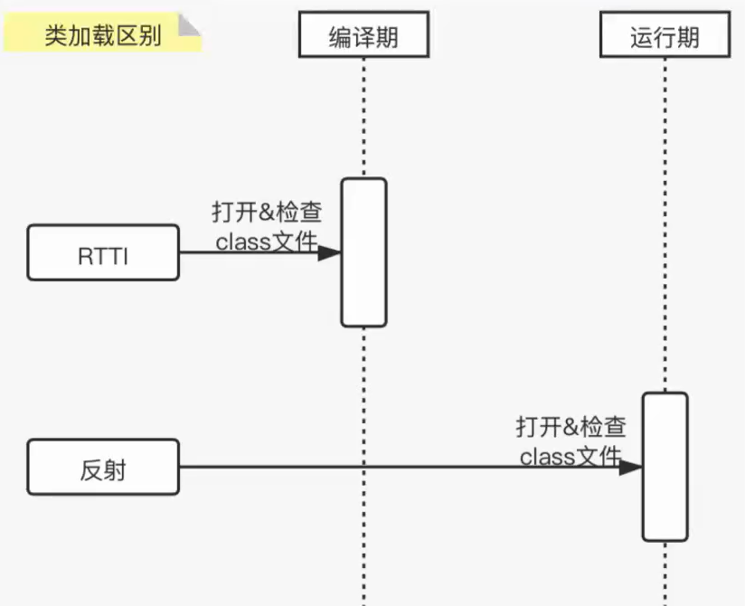
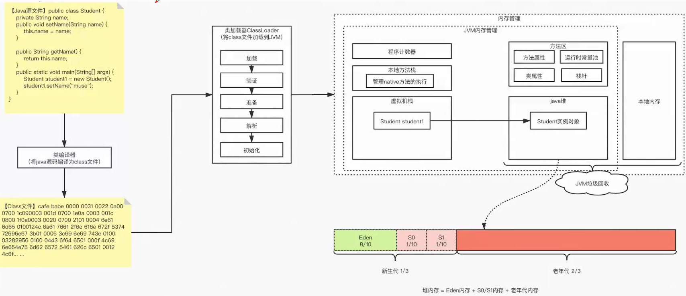
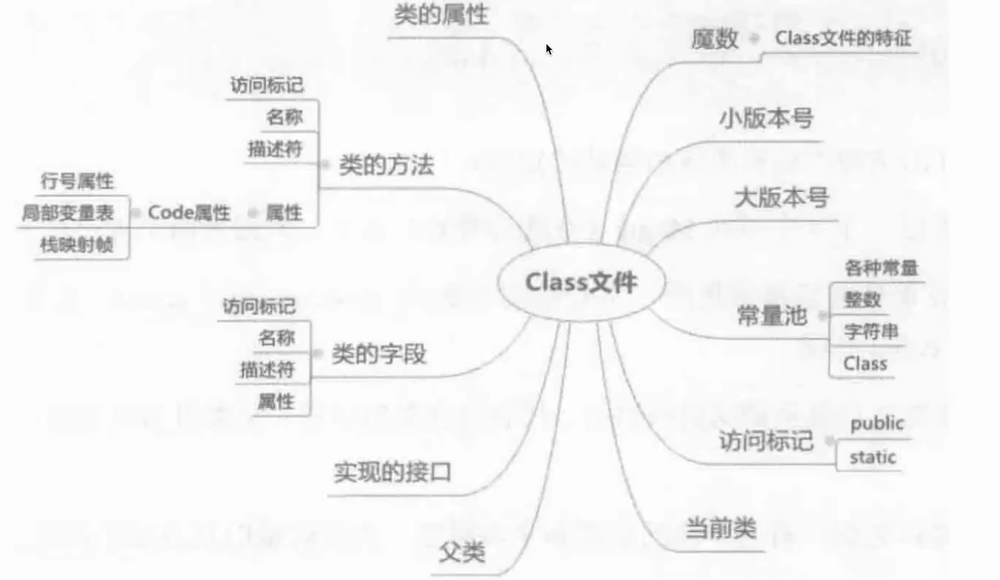
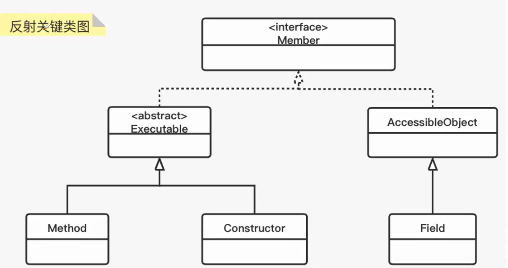
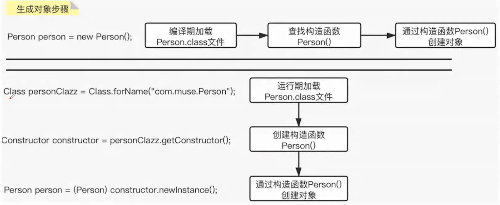

# 反射：

### 以前的方式

* 新建一个对象
  Student student = new Student();

* 使用这个对象
  student.study("数学");

### 为什么有反射?（我们不知道这个类里有什么方法，不知道怎么使用它。
* 程序运行过程：编译期(写完代码，进行编译——javac)&运行期（服务已经运行了。。。)

* 答:在运行期，根据某种条件，才能确定使用哪个类的对象的时候，我们就会采用反射了。

* 特点：较为灵活，如在策略模式下可以改变某些变量：

  策略模式：https://www.runoob.com/design-pattern/strategy-pattern.html

  * abstract BaseStrategy.execute()

    ```java
    BaseStrategy.execute( ) { 
    //执行某种策略
    }
    ```

    * 满足分享10次——>AStrategy

    * 满足分享30次——>BStrategy

    * 满足分享50次——>CStrategy 

* 利用反射可以修改里面的次数为任意次数，这样可以定制，使其策略变得更加灵活。

### 类加载区别



* 编译期：new一个对象，编译成class文件，加载到内存，相当于一开始我们就知道了要用的对象的方法了。
* 运行期：不知道要用的对象方法，使用反射去动态打开和检查class文件。

### JVM里类加载的过程



* 代码==》class文件==》进行加载五步==》放进jvm

* 因为java的class文件和我们写的代码对于jvm而言是一样的，所以可以使用class文件进行一个反射操作。

### class文件包含的内容



* 左边是我们写的代码源码内容，右边是类的信息。

### 生成对象步骤



* method：方法 、constructor：构造方法 、field：属性

### 生成对象具体步骤



* 正常方式：加载class文件==》查找构造函数==》通过构造函数创建对象

* 使用反射：使用Class.forName得到class文件（第一步一样）==》获取构造函数（第二步也一样）==》创建对象（第三步一样）

  ```java
  Class personClazz1 =Class.forName（"com.zsp.person"）;
  Class personClazz2 =Class.forName（"com.zsp.person"）;
  if(personClazz1 == personClazz2)?是否相等？相等，因为class文件只有一个
  ```

经过比较后会发现二者基本相同，不同的是触发时期和触发点不同：正常new使用是在编译期，使用反射则是在运行期。

### 获得Class对象的方式有几种？ 

* 通过getClass()方式：（需要先new一个对象出来在用）

  ```java
  Class clazz =person.getClass();
  ```
  
* 通过Class.forName：（什么操作都不需要进行）

  ```java
  Class clazz2=Class.forName("com.zsp.Person");
  ```

* 通过.class：（需要先new一个对象进行初始化，初始化完毕后可以去掉对象）

  ```
  Class clazz3 =Person.class;
  ```

* 反射获取类对象示例代码：

  ```java
  public class ReflectionTest {
      public static void main(String[] args) throws ClassNotFoundException, NoSuchMethodException, IllegalAccessException, InvocationTargetException, InstantiationException {
          Class clazz = Class.forName("reflection.Person");  //方法1
  //        Person person = new Person();  //方法2
  //        Class clazz = person.getClass();
  //        Class clazz = Person.class; //方法3
          Constructor constructor1 = clazz.getConstructor();
          Constructor constructor2 = clazz.getConstructor(String.class, int.class, int.class);
          Person person1 = (Person) constructor1.newInstance();
          Person person2 = (Person) constructor2.newInstance("zsp",1,23);
          person1.setName("zsp");
          System.out.println(person1);
          System.out.println(person2);
      }
  }
  ```

### 通过反射获取属性值：

* public类型的（两个方法

```java
public class GetFieldTest {
    public static void main(String[] args) throws NoSuchFieldException, IllegalAccessException, ClassNotFoundException, NoSuchMethodException, InvocationTargetException, InstantiationException {
        //获得class对象
        Class personClass=Person.class;
        //获取构造器
        Constructor constructor = personClass.getConstructor();
        //获取类
        Person person = (Person) constructor.newInstance();
        //获得filed对象， Person[类]的name属性
        //Field nameFild = personClass.getField("name");
        //这两个方法都可以，但推荐第二个，因为第一个如果不是public就报空指针
        Field nameFild = personClass.getDeclaredField("name");
        //通过filed获取对应对象里的属性值
        System.out.println(nameFild.get(person));
    }
}
```

* 其他类型（private、protected、不填

```java
public static void main(String[] args) throws NoSuchMethodException, IllegalAccessException, InvocationTargetException, InstantiationException, NoSuchFieldException {
        //获得class对象
        Class personClass=Person.class;
        //获取构造器
        Constructor constructor = personClass.getConstructor();
        //获取类
        Person person = (Person) constructor.newInstance();
        //获得filed对象， Person[类]的name属性
        Field genderFild = personClass.getDeclaredField("gender");
        //允许访问private属性
        genderFild.setAccessible(true);
        //通过filed获取对应对象里的属性值
        System.out.println(genderFild.get(person));
    }
```

### 总结

* 通过反射获得类的public属性值 
* getField只能获取public的，包括从父类继承来的字段。
* getDeclaredField可以获取本类所有的字段，包括private的，但是不能获取继承来的字段。除非加上setAccessible(true))

#### 实现一个工具类

我们采用反射机制来实现一个工具BeanUtils,可L以将一个对象属性相同的值赋值给另一个对象。

* 工具类作用：

  * 1>单体服务、微服务(垂直分割)
  * 2>服务的层次划分(水平分割) 

  ```shell
  MvC水平分层:每一层，是不是都有承载着结果的实体类呢?
  视图层: vo (v-view) /uo
  应用层:DTO/Entity    （java bean
  领域层:Domina Entityrvo (V-value)   （java bean
  基础设置层:PO(Persistent持久层)    （java bean
  
  依赖关系：
  视图层依赖于应用层，
  应用层依赖于领域层，
  基础设置层依赖于领域层。（依赖倒置，不懂可以看我的理论笔记）
  ```
  
  ##### 想要实现的功能就是：VO层传递给PO层
  
  PersonPO——> PersonVO 	(PersonVO  personVO= new PersonVO();
  BeanUtils .convertor( personPO, personVO）

### 代码实现

```java
public class BeanUtils {
    /**
     *
     * @param originObj 需要被取值的对象
     * @param targetObj 需要被赋值的对象
     * @throws IllegalAccessException   获取异常
     */
    public static void convertor(Object originObj,Object targetObj) throws IllegalAccessException {
//        获取二者的类对象
        Class originObjClass = originObj.getClass();
        Class targetObjClass = targetObj.getClass();
//        获取filed对象
        Field[] originFields = originObjClass.getDeclaredFields();
        Field[] targetFields = targetObjClass.getDeclaredFields();
//        遍历两个对象寻找相同的属性，并赋值
        for (Field originField : originFields) {
            for (Field targetField : targetFields) {
                if (originField.getName().equals(targetField.getName())){
                    originField.setAccessible(true);
                    targetField.setAccessible(true);
                    targetField.set(targetObj,originField.get(originObj));
                }
            }
        }
    }
}

```

### 演示结果

