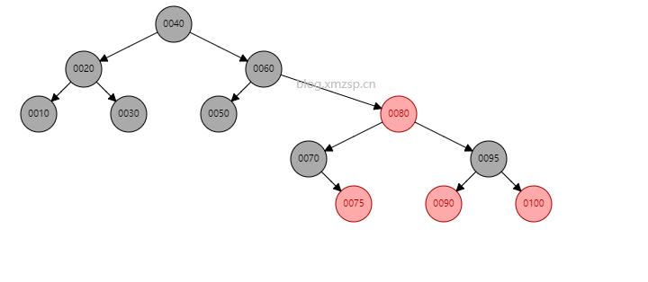

# 题容器源码

温馨提醒：idea的进入源码只要点击鼠标滑轮，返回上级只要输入Ctrl+alt+←

### ArrayList：

* 底层数据结构：数组，没什么好说的，后续比如链表或者红黑树，我会细讲。

```java
   public ArrayList() {
        this.elementData = DEFAULTCAPACITY_EMPTY_ELEMENTDATA;//（值为空{}，空数组）
    } 
```

#### Add方法：（面试可以秀一下grow过程）

* 第一次新增元素，minCapacity=size+1=0+1=1（size初始为0）

```java
    public boolean add(E e) {
        ensureCapacityInternal(size + 1);  // size初始为0
        elementData[size++] = e;
        return true;
    }
```

* 点击ensureCapacityInternal再往底层
  * （elementData、DEFAULTCAPACITY_EMPTY_ELEMENTDATA是一个对象数组，初始为空）
  * DEFAULT_CAPACITY初始为10，可以说是初始容量，（但不是在这里决定的

```java
 private void ensureCapacityInternal(int minCapacity) {
        if (elementData == DEFAULTCAPACITY_EMPTY_ELEMENTDATA) {
            //如果这是第二个元素放入，则不会进入判断而是直接返回minCapacity大小的容量
            minCapacity = Math.max(DEFAULT_CAPACITY, minCapacity);  //取出最大值，此时minCapacity=10
        }
        ensureExplicitCapacity(minCapacity);
    }
```

* 在进入ensureExplicitCapacity方法里查看
  * modCount初始为0，并且被**transient**修饰，保证不参与序列化和反序列化。是一个计数器，记录ArrayList进行add和remove的次数。

```java
private void ensureExplicitCapacity(int minCapacity) {
        modCount++;   						//记录add和remove操作次数
        // overflow-conscious code
        if (minCapacity - elementData.length > 0)   //elementData初始为0代表原有数组，minCapacity初始为10 
            grow(minCapacity);
    }
```

* ArrayList扩容
  * oldCapacity代表原来数组长度：旧的数组长度
  * newCapacity代表新生成的数组长度：旧的数组长度+旧的数组长度右移一位
  * MAX_ARRAY_SIZE：Integer的最大长度-8（减去8是因为jvm运行需要一些头字，大小为8）

```java
private void grow(int minCapacity) {
    // overflow-conscious code
    int oldCapacity = elementData.length;  //拿到原来数组
    int newCapacity = oldCapacity + (oldCapacity >> 1); //>>代表右移，右移移位相当于除2，所以整体长度为1.5倍原数组
    if (newCapacity - minCapacity < 0) //如果新的数组长度小于minCapacity长度（初始为size+1，为1，后面变为10）
        newCapacity = minCapacity;  //扩容长度变为初始容量10
    if (newCapacity - MAX_ARRAY_SIZE > 0) //怕超过数字的最大容量-8，为什么减去8，因为jvm会保存一些头字，这些为8
        newCapacity = hugeCapacity(minCapacity);
    // minCapacity is usually close to size, so this is a win:
    elementData = Arrays.copyOf(elementData, newCapacity);
}
```

* 进入hugeCapacity源码继续查看

```java
	private static int hugeCapacity(int minCapacity) {
        if (minCapacity < 0) // overflow  //为什么超过了Integer最大长度-8还会小于0，因为溢出了二进制最大值
            throw new OutOfMemoryError(); //OOM异常
        return (minCapacity > MAX_ARRAY_SIZE) ?	Integer.MAX_VALUE :MAX_ARRAY_SIZE;
        //如果没有溢出，则妥协 返回Integer最大长度给她
    }
```

* 最后使用copyOf，将旧数组的值赋值给新数组

```java
 elementData = Arrays.copyOf(elementData, newCapacity);
```

* 最后再返回add方法里，将索引挪到下一位，然后把元素添加进去

```java
  elementData[size++] = e;
        return true;
```

#### Get方法：

* get方法进入

```java
   public E get(int index) {
        rangeCheck(index);  //进入判断索引有没有超过数组最大长度
        return elementData(index);
    }

```

* 进入rangeCheck方法

```java
    private void rangeCheck(int index) {
        if (index >= size)  //索引不能超过数组最大值，否则异常
            throw new IndexOutOfBoundsException(outOfBoundsMsg(index));
    }
```

* 进入elementData方法
  * 这里面的E就是T，泛型

```java
    E elementData(int index) {
        return (E) elementData[index];  //从elementData数组中取值返回
    }
```

#### Remove方法：(面试可以秀一下arraycopy过程)

* remove方法是通过元素移动来实现的，先提取出要移动的元素，然后进行移动，最后将其值赋为空，jvm会帮我们自动处理数组内值为null的元素。 

```java
public E remove(int index) {       //默认数组为{a1,a2,a3,a4,a5}
    rangeCheck(index); 
    modCount++; //计数器，记录add和remove了几次操作
    E oldValue = elementData(index); //从数组中取出索引对应元素
    int numMoved = size - index - 1; //记录要移动的元素个数，例如你删除的元素索引值为“2”,则得到2
    if (numMoved > 0)				//当要移动的值大于0，因为有可能删除的是最后一个元素，就没有移动的元素
        System.arraycopy(elementData, index+1, elementData, index,numMoved);
    elementData[--size] = null; // clear to let GC do its work
    return oldValue;
}
```

* rangeCheck：检查索引是否超过数组范围

```java
   private void rangeCheck(int index) {
        if (index >= size)
            throw new IndexOutOfBoundsException(outOfBoundsMsg(index));
    }
```

* System.arraycopy：是一个本地方法，下面方法运行过程
  * 默认数组为{a1,a2,a3,a4,a5},删除了a3，此时numMoved=2，要移动2个元素。
  * 第一个传入数组是原数组，从index+1（a4）开始复制numMoved位（2位）带第二个elementData的第三个位置中（原本a3位置）
  * 最终得到的数组是{a1,a2,a4,a5,a5}

```java
  public static native void arraycopy(Object src,  int  srcPos,Object dest, int destPos,int length);
 //下面是从remove里抠下来的方便解释
//
  System.arraycopy(elementData, index+1, elementData, index,numMoved);
```

* 最终将最后一个元素赋值为null，让JVM的GC帮我们处理空值，结果为{a1,a2,a4,a5}

```java
  elementData[--size] = null; // clear to let GC do its work
    return oldValue;
```

### LinkedList

#### 底层数据结构

LinkedList底层数据结构：双向链表（每个队列都有独立的前置结点指针+后置结点指针+元素）

```java
    private static class Node<E> {
        E item;  //队列存储的元素
        Node<E> next;  //后置结点指针
        Node<E> prev;	//前置结点指针
        Node(Node<E> prev, E element, Node<E> next) {
            this.item = element; //传入的元素
            this.next = next;   //后置结点指针
            this.prev = prev;    //前置结点指针
        }
    }
```

单向链表：只有next，作为后置结点指针，指向下个结点。

双向链表：next和prev都有，一个指针指向后置结点，另一个指向前置结点。


#### Add方法：

* 将传入元素传递给linkLast方法：

```java
    public boolean add(E e) {
        linkLast(e);
        return true; //插入无需判断越界，所以直接返回true
    }
```

* 进入linkLast方法：
  * node是什么，前面刚开始介绍了。
  * last也是一个Node类，初始值为空，表示上个结点：transient Node<E> last;
  * fist也是一个Node类，初始值为空，表示第一个结点：transient Node<E> first;

```java
    void linkLast(E e) {
        final Node<E> l = last; //l表示上个结点，如果为第一个则为null
        final Node<E> newNode = new Node<>(l, e, null); 
        //传入一个新的结点后，前置结点就是链表以前的最后一个结点，后置结点为空
        last = newNode; //最后一个结点变为新的结点
        if (l == null) //如果l为空说明现在传入的是链表的第一个结点
            first = newNode; //第一个结点变为新传入的结点
        else  //否则上个结点的下置结点变为当前传入的新节点
            l.next = newNode;
        size++;  //大小+1
        modCount++;   //统计进行了多少次add和remove
    }
```

第一个元素插入：


往后的元素插入：


#### Get方法

* 进入方法内部，主要先判断长度有没有越界，没有就取值出来。

```java
public E get(int index) {
    checkElementIndex(index);
    return node(index).item;
}
```

* 进入checkElementIndex方法内部：判断传入的index是否超过固有长度。

```java
    private void checkElementIndex(int index) {
        if (!isElementIndex(index))
            throw new IndexOutOfBoundsException(outOfBoundsMsg(index));
    }

```

* 再进入isElementIndex：发现是拿add方法中的size和index。

```java
   private boolean isElementIndex(int index) {
        return index >= 0 && index < size;
    }
```

#### Remove方法：

* 进入方法内部，和get方法一样先判断是否越界，这里不再赘述。

```java
    public E remove(int index) {
        checkElementIndex(index);
        return unlink(node(index));//传入索引查出结点，而后把结点放入unlink方法中
    }
```

* 进入node方法，查看取出结点过程。
  * index < (size >> 1)：判断索引是大于还是小于长度的一半。
    * 大于就从头遍历,找到目标结点的上一个结点的后置节点指针，根据指针得到对应结点。
    * 小于就从尾遍历,找到目标结点的下一个结点的前置节点指针，根据指针得到对应结点。

```java
    Node<E> node(int index) {
        // assert isElementIndex(index);
        if (index < (size >> 1)) { //判断索引是大于还是小于长度的一半，大于就从头遍历
            Node<E> x = first;
            for (int i = 0; i < index; i++) //
                x = x.next;
            return x;
        } else {  //小于就从尾巴开始遍历
            Node<E> x = last;
            for (int i = size - 1; i > index; i--)
                x = x.prev;
            return x;
        }
    }
```

* 进入unlink方法：有点多，但是不要怕，看注释，一步步都写好了。

```java
    E unlink(Node<E> x) {
        // assert x != null;
        final E element = x.item;
        final Node<E> next = x.next;
        final Node<E> prev = x.prev;
		//刚开始把传入的结点全部取出
        if (prev == null) { //如果前置结点指针为空，说明这个是第一个结点
            first = next;  //把首结点标记给到下一个结点
        } else {			//否则， 说明不是首结点
            prev.next = next; //把前置结点的后置指针指向删除的结点的下个结点
            x.prev = null; //把要删除结点的前置指针置为空
        }

        if (next == null) { //如果要删除的后置结点指针为空，说明最后一个结点
            last = prev; //把尾结点的标记给到下一个结点
        } else { //否则，说明不是尾结点
            next.prev = prev;//把后置结点的前置指针指向要删除的结点的上个结点
            x.next = null;//把要删除结点的后置指针置为空
        }
        x.item = null; //把要删除结点的值置为空
        size--; //长度减少1
        modCount++; //操作次数+1，remove和add都会增加modCount的次数
        return element; //返回这个结点的值，以置空
    }
```

### Hashmap

​	底层数据结构：JDK1.7散列表（数组+链表），JDK1.8数组+链表/红黑树，这里我详细给大家介绍一下，当然想了解树的演变过程可以看我的下一篇文章。下面，先说下术语，然后在开始讲数据结构：

#### 术语：先给大家解释下术语，防止看不懂

​    这里说一下桶，网上大部分博客意见不一，有的把数组叫做桶，有的把整个数组和链表叫做桶，个人拙见，桶应该是单个数组对应的链表称之为桶：

* 桶：就是这一条，看图，是一个数组里的元素和对应的一条链表，两个合起来称之为桶。
* 桶长：是这个数组里的某个元素对应的链表长度。
* 位桶：这个数组。


#### 底层数据结构

##### 散列表

先带大家认识下散列表，散列表就是数组+链表：

* 当数据进入时，会先拿到该元素的hash值给到数组，然后再有相同的hash值的数据进入到数组中的话，就会进行哈希碰撞，碰撞有两个方法（拉链法和开放定址法）。
  * 拉链法：当一个元素存储进散列表的时候，会先计算哈希值，然后放到数组里。遇到下一个放进来的元素和它的哈希值相同，就放到相同的链表里。
  * 开放定址法：当一个元素存储进散列表的时候，会先计算哈希值，然后放到数组里。遇到下一个放进来的元素和它的哈希值相同，就放到这个元素的下一个数组里(所以这个方法和底下这个图不匹配，不用看了)。


##### 红黑树

  hashmap无非就是数组+链表（JDK1.7）或者数组+链表/红黑树（JDK1.8)散列表已经说完了，下面讲一讲红黑树，可能入门有点难度，如果看不懂的话，可以先看我的文章《树的演变》：

  首先红黑树先记下来五个特点：

* 每个节点或者是黑色，或者是红色。
* 根节点是黑色。
* 每个叶子节点（NIL）是黑色。 [注意：这里叶子节点，是指为空(NIL或NULL)的叶子节点！]
* 如果一个节点是红色的，则它的子节点必须是黑色的。
* 从一个节点到该节点的子孙节点的所有路径上包含相同数目的黑节点。

注意：

* 特性(3)中的叶子节点，是只为空(NIL或null)的节点。
*  特性(5)，确保没有一条路径会比其他路径长出俩倍。因而，红黑树是相对是接近平衡的二叉树。

  这里解释下什么是 nil、Nil、NULL、NSNull （不区分大小写）：

```java
nil：指向一个对象的空指针,对objective c id 对象赋空值.
Nil：指向一个类的空指针,表示对类进行赋空值.
NULL：指向其他类型（如：基本类型、C类型）的空指针, 用于对非对象指针赋空值.
NSNull：在集合对象中，表示空值的对象.
```

 以下是对应五个特点画出来的红黑树图：画的不好看，见谅。。。

 

  任何用来存储的数据结构，最主要的还是**添加**、**删除**。在对红黑树进行添加或删除之后，都会用到旋转方法。为什么呢？道理很简单，添加或删除红黑树中的节点之后，红黑树就发生了变化，可能不满足红黑树的5条性质，也就不再是一颗红黑树了，而是一颗普通的树。而通过旋转，可以使这颗树重新成为红黑树。简单点说，旋转的目的是让树保持红黑树的特性。
  旋转包括两种：**左旋** 和 **右旋**。下面分别对它们进行介绍。 

###### 左旋

步骤如下：（左旋左子树，改变左子树，并变成左子树）

* 先将Y的｛左｝子树给X。
* 将X父亲给Y ，这时候有三种情况，如图所示。
* 最后完成了左旋。


###### 右旋

步骤如下：（右旋,改变右子树，并变成右子树）

* 先将X的｛右｝子树给Y。
* 将Y父亲给X ，这时候有三种情况，如图所示。
* 最后完成了右旋。


足够细心的话会发现，左右旋是对称的，即左旋以后再右旋就能回到原本的样子。

* 左旋就提旋转目标的右子树上去，使自身变成右子树。
* 右旋就提旋转目标的左子树上去，使自身变成左子树。

   举例：以下都以X为旋转目标：


这一块想看代码可以看我的《树的演变》一章，里面会详细告诉大家，树的相关操作的所有代码。

###### 添加

  在讲添加时，我们先讲一下，插入元素应该要做的事：

**第一步: 将红黑树当作一颗二叉查找树，将节点插入。**
    红黑树本身就是一颗二叉查找树，将节点插入后，该树仍然是一颗二叉查找树。也就意味着，树的键值仍然是有序的。此外，无论是左旋还是右旋，若旋转之前这棵树是二叉查找树，旋转之后它一定还是二叉查找树。这也就意味着，任何的旋转和重新着色操作，都不会改变它仍然是一颗二叉查找树的事实。
    好吧？那接下来，我们就来想方设法的旋转以及重新着色，使这颗树重新成为红黑树！

**第二步：将插入的节点着色为"红色"。**
    为什么着色成红色，而不是黑色呢？为什么呢？在回答之前，我们需要重新温习一下红黑树的特性：
(1) 每个节点或者是黑色，或者是红色。
(2) 根节点是黑色。
(3) 每个叶子节点是黑色。 [注意：这里叶子节点，是指为空的叶子节点！]
(4) 如果一个节点是红色的，则它的子节点必须是黑色的。
(5) 从一个节点到该节点的子孙节点的所有路径上包含相同数目的黑节点。
    将插入的节点着色为红色，不会违背"特性(5)"！少违背一条特性，就意味着我们需要处理的情况越少。接下来，就要努力的让这棵树满足其它性质即可；满足了的话，它就又是一颗红黑树了。o(∩∩)o...哈哈

**第三步: 通过一系列的旋转或着色等操作，使之重新成为一颗红黑树。**
    第二步中，将插入节点着色为"红色"之后，不会违背"特性(5)"。那它到底会违背哪些特性呢？
    对于"特性(1)"，显然不会违背了。因为我们已经将它涂成红色了。
    对于"特性(2)"，显然也不会违背。在第一步中，我们是将红黑树当作二叉查找树，然后执行的插入操作。而根据二叉查找数的特点，插入操作不会改变根节点。所以，根节点仍然是黑色。
    对于"特性(3)"，显然不会违背了。这里的叶子节点是指的空叶子节点，插入非空节点并不会对它们造成影响。
    对于"特性(4)"，是有可能违背的！
    那接下来，想办法使之"满足特性(4)"，就可以将树重新构造成红黑树了。

  下去这部分可能有点难度，大家跟好车，先看一下这部分伪代码，这里我们是要插入z，然后在节点Y下插入的，我将插入数据分为两步，**插入**和**染色**：

* 插入：这里是假设存在Y这个节点，然后分为三种情况

  * Y是空节点，则插入的Z就变成了唯一节点，即根
  * Z<Y，把Z设为左孩子。
  * Z>Y，把Z设为右孩子。

  最后进行插入节点的左右孩子设空，还有插入节点着色，这部分相对简单，就不给图了。

```java
RB-INSERT(T, z)  
  y ← nil[T]                        // 新建节点“y”，将y设为空节点。
  x ← root[T]                       // 设“红黑树T”的根节点为“x”
  while x ≠ nil[T]                  // 找出要插入的节点“z”在二叉树T中的位置“y”
      do y ← x                      
         if key[z] < key[x]  
            then x ← left[x]  
            else x ← right[x]  
  p[z] ← y                          // 设置 “z的父亲” 为 “y”
  if y = nil[T]                     
     then root[T] ← z               // 情况1：若y是空节点，则将z设为根
     else if key[z] < key[y]        
             then left[y] ← z   // 情况2：若“z所包含的值” < “y所包含的值”，则将z设为“y的左孩子”
             else right[y] ← z  // 情况3：(“z所包含的值” >= “y所包含的值”)将z设为“y的右孩子” 
  left[z] ← nil[T]              // z的左孩子设为空
  right[z] ← nil[T]             // z的右孩子设为空。至此，已经完成将“节点z插入到二叉树”中了。
  color[z] ← RED                // 将z着色为“红色”
  RB-INSERT-FIXUP(T, z)         // 通过RB-INSERT-FIXUP对红黑树的节点进行颜色修改以及旋转，让树T仍然是一颗红黑树
```

* 染色：分为三种情况
  * 如果插入的元素是根节点，那么**直接插入然后染色黑色**。
  * 插入节点的父节点是黑色，因为我们插入的是红色，满足5个特性，**所以不需要染色**。
  *  被插入的节点的父节点是红色。，因为和特性不符，所以分为以下三种情况处理：

```java
RB-INSERT-FIXUP(T, z)
while color[p[z]] = RED                   // 若“当前节点(z)的父节点是红色”，则进行以下处理。
    do if p[z] = left[p[p[z]]]     // 若“z的父节点”是“z的祖父节点的左孩子”，则进行以下处理。
          then y ← right[p[p[z]]]  // 将y设置为“z的叔叔节点(z的祖父节点的右孩子)”
               if color[y] = RED   // Case1 父节点是红色，叔叔节点（父节点的兄弟节点）是红色的。
                  then color[p[z]] ← BLACK         情况1//(01) 将“父节点”设为黑色。
                       color[y] ← BLACK            情况1//(02) 将“叔叔节点”设为黑色。
                       color[p[p[z]]] ← RED        情况1//(03) 将“祖父节点”设为“红色”。
                       z ← p[p[z]]                 情况1//(04) 将“祖父节点”设为“当前节点”(红色节点)
                  else if z = right[p[z]]          // Case 2 叔叔是黑色，且当前节点是右孩子
                          then z ← p[z]            情况2//(01)将“父节点”作为“新的当前节点”。
                               LEFT-ROTATE(T, z)   情况2//(02)以“新的当前节点”为支点进行左旋。
                          color[p[z]] ← BLACK      // Case 3 叔叔是黑色，且当前节点是左孩子。(01) 将“父节点”设为“黑色”。
                          color[p[p[z]]] ← RED     情况3//(02) 将“祖父节点”设为“红色”。
                          RIGHT-ROTATE(T, p[p[z]]) 情况3//(03) 以“祖父节点”为支点进行右旋。
       else (same as then clause with "right" and "left" exchanged)   // 若“z的父节点”是“z的祖父节点的右孩子”，将上面的操作中“right”和“left”交换位置，然后依次执行。
color[root[T]] ← BLACK
```

**三种情况图解**：

* 父节点是红色，叔叔节点（父节点的兄弟节点）是红色的，下图是左右孩子。	
  * 将父节点和叔叔节点染成黑色，祖父节点染成红色即可。


* 父节点是红色，叔叔节点是黑色，添加的节点是父节点的左孩子。
  * 先将父节点染成黑色；
  * 将祖父节点染成红色；
  * 将父节点进行右旋；


* 父节点是红色，叔叔节点是黑色，添加的节点是父节点的右孩子。
  * 先将父节点左旋
  * 先将子节点染色
  * 将祖父节点染色
  * 把祖父节点右旋


  至此，添加操作完成了，当然最难的还不是添加操作，而是删除操作，因为删除操作不仅得满足五点原则，还得满足平衡二叉树。

###### 删除

  这边粗略先介绍下二叉树节点删除思路，如果需要看更详细内容，可以看我下一篇文章《树的演变》。

**二叉树节点删除的思路**

- 如果要删除的节点正好是叶子节点，直接删除即可；
- 如果要删除的节点还有子节点，就需要建立父节点和子节点的关系：
  - 如果只有左孩子或者右孩子，直接把这个孩子上移放到要删除的位置就好了；
  - 如果有两个孩子，就需要选一个合适的孩子节点作为新的根节点，该节点称为 继承节点。（新节点要求比所有左子树要大、比右子树要小，我们可以选择左子树中的最大节点，或者选择右子树中的最小的节点。）

**红黑树节点删除的思路**

   我们需要在二叉树删除的思路上，再考虑对删除完后的树进行调整。 二叉树的平衡分为两打点或三个小点，而二叉树还要再去进行相应调整，这样对我们来说工作量太大了，所以我们将这些东西合并在一起来讲述。

* 先进行二叉树的删除，分为三种情况：这边删除的是z
  * 如果删除节点没有孩子，则说明是叶子，直接删除即可。（步骤A）
  * 如果删除的节点只有一个孩子，则用这个唯一的儿子去代替它即可。（步骤B）
  * 如果删除的节点有两个孩子，则要进行两步处理：
    *   如果有两个孩子，就需要选一个合适的孩子节点作为新的根节点，该节点称为继承节点。 选择孩子节点中，左子树中的最大节点（左树最右），或者选择右子树中的最小的节点（右树最左），成为继承节点。
    * 然后再将选择的继承节点的孩子节点重复步骤A或步骤B即可。（不用考虑两个孩子的情况，因为如果有孩子就不可能是子树最左或者最右）。

  如下图所示，删除的是80这个元素，如果你能推出可以成为继承节点的是75或者90，就说明可以了。（忽略颜色）




  因为染色需要对比五个性质是否被改变，所以这里提一嘴五个性质：

```
* 每个节点或者是黑色，或者是红色。
* 根节点是黑色。
* 每个叶子节点（NIL）是黑色。 [注意：这里叶子节点，是指为空(NIL或NULL)的叶子节点！]
* 如果一个节点是红色的，则它的子节点必须是黑色的。
* 从一个节点到该节点的子孙节点的所有路径上包含相同数目的黑节点。
```

* 染色：染色只针对黑色，如果是红色节点删除，不会影响五个性质，红黑树的结构不被破坏，也就不需要进行调整。如果我们判断删除节点的颜色为黑色，那么就进行调整；这里再提一嘴五个性质。
  * 染色情况1：当前节点是黑色的，且兄弟节点是红色的（T是我们的目标节点，就是已经替换上的节点）
    * 先把兄弟节点染黑，父亲节点染红，以P节点为中心，左旋。

  * 染色情况2：当前节点是黑色的，且兄弟节点是黑色的，这里分为三种情况。

    * 兄弟节点的左子节点是红色，右子节点时黑色的： 将兄弟节点涂红，将当前节点指向其父节点，将其父节点指向当前节点的祖父节点，继续往树根递归判断以及调整；

    

    * 兄弟节点的两个子节点均为黑色的：

     