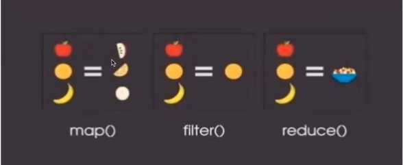
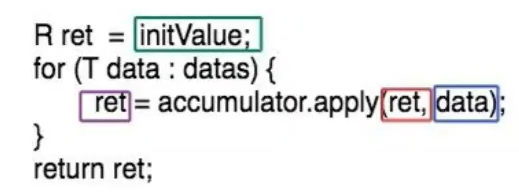

# Stream流

### Stream VS List

* Stream可以是无限的

* Stream可并行处理

* Stream可能延迟处理

###  创建Stream:
* 静态数据Stream.of()

* 容器collection.stream()
* 动态stream.iterate() & Stream.generate () （导致了stream可以有限也可以无限）
* 其他api:Files.lines()...

如下图，点击事件中，将连续点击归为一个点，而后变为次数，最后只统计连续点击一次以上的：

​	我们只负责告诉stream流要什么结果，但做了什么，我们不知道。


### Stream的基本操作

##### lntermediate（可以进行无限次操作）

* filter
* distinct
* skip
* limit
* map/flatMap
* sorted

#### Terminal（只能进行一次操作，且应是最后）

* Mcount/sum
* collect/reduce
* forEach
* anyMatch/allMatch/noneMath

### FP编程三板斧

* filter(Predicate predicate)（过滤）

* map(Function mapper) （映射，日常用的最多，进行操作）

* reduce(U identity,BinaryOperator acc)（把一个流折叠起来，归起来）



### 理解reduce

reduce相当于做迭代操作的一个for：


以下是for的循环操作：



不同点：for是不听的调用了其本身，而reduce不是，调用的是函数。

具体例子：

```java
ArrayList<Integer> list = new ArrayList<>();
list.add(1);list.add(2);list.add(3);list.add(4);list.add(5);list.add(6);
Integer integer = list.stream().reduce((a, b) -> a + b).get();
System.out.println(integer);
```

例子的示意图：


### reduce实战

* 求和
* 求最大值/最小值
* 串联成字符串
* 存放进collection
* 用reduce实现map
* 用reduce实现filter
* transducer

1、求和

```java
//          1、对list进行求和
    public static int sum(Collection<Integer>list){
        return list.stream().reduce(0,(acc,curr)->acc+curr);
    }

```

2、求最大值/最小值

```java
//            2、求最大值
    public static int max(Collection<Integer>list){
//        return list.stream().reduce(0,(max,curr)->max>curr?max:curr);
        return list.stream().reduce(Math::max).orElse(null);
    }
```

3、串联成字符串

```java
//            3、拼串
    public static String join(Collection<String>list,String str){
//			  把list当成
        return list.stream().reduce(str,(acc,curr)->{acc=acc+curr;return acc;});

    }
```

4、转换成集合list

```java
    public static <T> List<T> toList(Stream<T> stream){
//        return list.stream().reduce(0,(max,curr)->max>curr?max:curr);
//    return list.stream().reduce(0,(acc,curr)->acc+curr);
        List<T> ret =new ArrayList<>();
        return stream.reduce(ret,(acc,curr)->{acc.add(curr);return acc;},(list1,list2)->{list1.addAll(list2);return list2;});
    }
```

5、实现map

```java
    public static <T> List<T> toList(Stream<T> stream){
//        return list.stream().reduce(0,(max,curr)->max>curr?max:curr);
//    return list.stream().reduce(0,(acc,curr)->acc+curr);
        List<T> ret =new ArrayList<>();

        return stream.reduce(ret,(acc,curr)->{acc.add(curr);return acc;},(list1,list2)->{list1.addAll(list2);return list2;});
    }
```

6、实现filter

```java
    public static <T,R> List <T> filter(List<T> list, Predicate<T> predicate){
        List<T> arrayList = new ArrayList<>();
        return list.stream().reduce(arrayList,
                (acc,curr)->{
                    if (predicate.test(curr))
                    {acc.add(curr);}
                    return acc;},
                (list1,list2)->{list1.addAll(list2);
                    return list2;});
    }
```

了解使用reduce实现各种方法，方便以后我们可以定制化属于自己的stream流方法，如下：


  这里的add，mapFn，predicate都可以是一个reduce函数。

transducer函数，可以将reduce方法任意组合：（后面自己实现下！）

