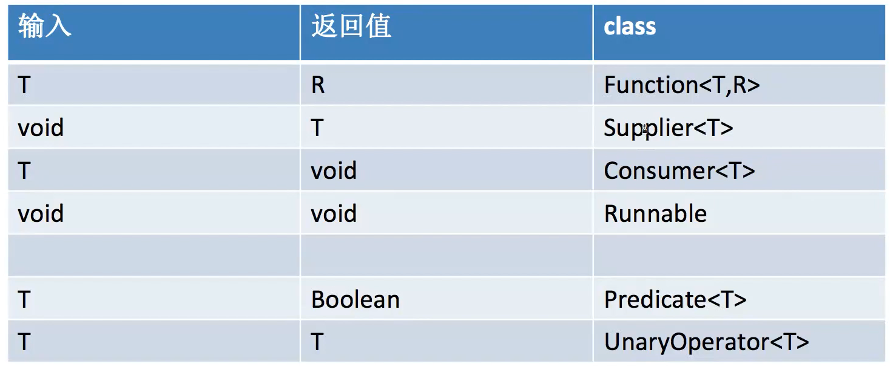

# 未来趋势：jdk8函数式编程（一）

​	往后两年的内卷趋势会从oop(面向对象)转向fp（函数式编程），所以标题挂上了未来趋势。这部分我会分为两个部分笔记进行叙述，以下是整体大纲。本章仅为入门，教你函数式编程的语法和使用。

### 大纲

**JAVA8 FP基础**

* FP特点
* Lambda表达式基本语法
* 函数式接口
* 方法引用

**JAVA8 FP进阶**

*  Stream基础API
* Filter/map/Reduce.
* Transducer


### 什么是函数式编程
*  一种编程范式
*  函数作为第一对象（1、函数可以作为一个变量。2、函数可以作为一个参数。3、返回值也可以是一个函数）
*  注重描述而非具体执行步骤（类似于写sql，把条件写好，然后去查询，而不是告诉数据库走哪个索引，怎么去查询）
  *  什么是“高级”和"低级"语言，相对于抽象的语言更为“高级“”，而具体到实现细节的语言较为“低级。（无意中伤

* 更关心代数结构之间的关系
* 不可变

  特别注意一点：FP和OOP并不是相互对立的，目前的语言趋势是趋近于混合的，所以不必刻意划清界限，OOP中可以有FP，FP下也能有OOP。代表语言：lisp(code as data)、js(前端经常用)、Scala。

  前端发展快，得益于js属于函数式语言，函数式语言让js这门语言进化的速度特别的快。

  特点2的三个体现，用js举例：fn是一个返回值，它是个函数。而a，b，c是传入的参数， 它们也可以是函数。

```java
	curry(fn)(a)(b)(c)
```

​	

### 函数式编程的编程特性

* 不可变（1、不用考虑并发问题。2、把对象状态变化完全拆解，减少了发生bug的可能性）
* 惰性求值（后面会讲，△留空标记△）
* 闭包（闭包能够将一个方法作为一个变量去存储，这个方法有能力去访问所在类的自由变量。）
* 高阶函数：callTwice就是一个高阶函数，可以在内部无限调用自己的内部函数，因为它的阶级比fn高。

```
 callTwice(fn){ return ()->{fn();fn();}}
```

* 柯里化（入门基础，后面会讲，目前jdk8用不了）
* 部分应用：可以不把参数写齐（目前jdk8用不了）

```java
 callTwice(a,b,c){}; fn2=callTwice(a,b); fn2(c);
```

* 结合率(一些组合)

目前java的jdk8只实现了部分FP功能，但后续更新的高阶版本已经逐步纳入了FP越来越多的功能，一定要学好这部分。


### JAVA8之前早已存在的适用函数式编程的场景(Lambda表达式解决的痛点)

* 创建线程 (匿名内部类，但匿名内部类会生成class文件，而lambda不会)
* 策略模式，如comparator
* UI编程
* 异步回调

### Lambda表达式

* 正常的方法：

```java
public static void fn（T param1,R param2...）{
    //......
	//......
}
```

* lambda表达式

```java
XXFunction fn=（T param1，R param2）->{
    //......
    //......
}
```

### Lambda表达式语法糖

​	原式:

```java
static Function<Integer,String> intString_1 =
            (Integer i)->{return String.valueOf(i);};
```

* 参数类型可推导

```java
static Function<Integer,String> intString_2 =
            (Integer i)-> String.valueOf(i);
```

* 单行可省略大括号

```java
    static Function<Integer,String> intString_3 =
            (i)-> String.valueOf(i);
```

* 单参数可省略小括号

```
    static Function<Integer,String> intString_4 =
            i-> String.valueOf(i);
```

### 函数式接口SAM(Single Abstract Method)

* 只有一个方法

```java
@FunctionInterface   //非必要，如果加上，编译器会进行校验   @FunctionInterface是为了告诉别人，他是函数式接口
public Interface Runnable{   //必须是interface
	public abstract void run(); //单个非默认/静态实现方法
}

相当于：Runnable r =() ->System.out.println("hello"); 
```

### 必须掌握的内置常用函数式接口



* Function<T,R>:传入的是T，传出的可以是R，说明传入和传出可以不同。
* Supplier <T>: 生产者，没有输入但是有产出。
* Consumer<T>:消费者，只有传入，没有传出。
* Runnable:无产出，也不消费。
* Predicate<T>：进行判断的方法，传入任意类型，产出布尔值。
* UnaryOperator<T,T>：传入和产出一样类型。

### 思考

```java
a->b->c->d代表什么？
```

```java
a->(b->c->d);  b->(c->d);c->d; 或 fn=a->b->c->d;相当于fn1=f(a);fn2=fn1(b);d=fn2(c);
特别注意：
    b->(c->d)是一个consumer，
    a->b->(c->d);是一个function，它的返回是b->(c->d)
	例：Function<T,Consumer> fn =a -> b->{}    
```

#### 如果传入的形参有两个怎么办？三个呢？

两个可以用：BiFunction ，三个用自定义的FP

* 先写几个函数式接口

```java
 @FunctionalInterface
public interface ZSP<A,B,C,D> {
    D apply(A a,B b,C c);}
```

```java
public class TestStaticMethod {
    public String name;
    public static Integer getNum(){return 233;}
}
```

* 运用定义的函数接口,最后使用ZSP这个自定义接口
  * sum是BiFunction的FP
  * integerSupplier是个Function类的FP
  * TestStaticMethod::getNum是一个方法引用
  * getSecondS是一个生产者类型的FP，生产出来的是integerSupplier

```java
private static BiFunction<Integer,Integer,Integer> sum=(a,b)->a+b;
private static Function<String,Integer> integerSupplier= (a)->Integer.valueOf(a);
private static Supplier<Function<String,Integer>> getSecondS=()->integerSupplier;
private static
    ZSP<BiFunction<Integer,Integer,Integer>,Supplier<Function<String,Integer>>,Supplier<Integer>,String>
            zsp= (a,b,c)->String.valueOf(a.apply(123,321)+b.get().apply("213")+c.get());
zsp.apply(sum,getSecondS,TestStaticMethod::getNum)
```


### 方法引用

* 静态方法→需要告之属于哪个类   									classX : :methodName
* 构造方法-→需要告之属于哪个类                                      classX :: new
* 指定实例方法→需要告之属于哪个实例                            instance :: methodName

  方法引用举例：有参则传入相应参数，无参则使用生产者FP

```java
//        初始化静态方法
        Function<Integer,String> function= TestStaticMethod::testMethod;
//        有参构造初始化了TestStaticMethod
        Function<String,TestStaticMethod> function1 =TestStaticMethod::new;
//无参构造初始化了TestStaticMethod
        Supplier<TestStaticMethod> supplier =TestStaticMethod::new;
```

​	假设doTwice是一个第三方方法，要你传入一个方法，可以传入的形式:

* 正常方法传入。	
* 传入lambda表达式。
* 传入方法引用。
* 传入缺少参数的方法引用：只能缺一个，而且都是第一个！

```java
		1、doTwice(Consumer<T> fn)   //正常的方法引用
        2、doTwice(a->xxx)  //传入lambda表达式
        3、doTwice(System.out::println) //传入方法引用
        4、doTwice(T::f);  //原式子是需要传入参数的，但我们可以使用方法引用，可以不传入参数。
		Class T{
            fn(){}
        }
```

#### 指定类型任意实例方法引用：

* Function可以比方法少一位参数，类里的方法如下：

```java
    private Integer getA(Integer a) {return a;}
```

* 使用并将其输出

```java
        BiFunction<LambdBase,Integer,Integer> function2= LambdBase::getA;
        System.out.println(function2.apply(new LambdBase(), 1));
```


### 函数式接口转换
​	由于JAVA是强类型，在某些场合下，我们并不要求函数签名完全一致时，可以进行转换。

* 忽略输入: Function <- Supplier

* 忽略返回:Consumer <-Function

* 忽略输入和返回:Runnable <- Supplier

#### 写一个工具类，用来转换函数式接口：

```java
public class FPUtils {
    public static <T,R>Function<T,R> S2F(Supplier<R> supplier){
        return a-> supplier.get();
    }
    public static <T,R>Consumer<T> C2F(Function<T,R> function){
        return a->function.apply(a);
    }
    public static <R> Runnable S2R(Supplier<R> supplier){
        return ()->supplier.get();
    }

}
```

#### 特殊的void-compatibility规则:

​	如果lambda是一个语句表达式，那么即使该lambda有返回值也可以赋值给返回值签名为void的函数：

​	只要代码只有一行，有返回值也没事，会被忽略掉：

```java
    private static Consumer<Integer> integerConsumer= a->a++;
    private static Runnable runnable= ()->Integer.getInteger("123");
```

