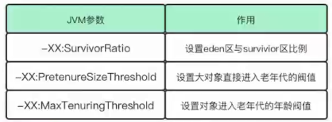
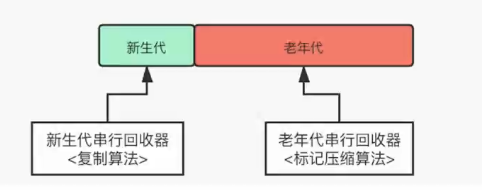

# JVM

## JVM内存模型


## JVM类加载流程和内存结构


## 类加载：classLoader

1>主动加载的方式有哪些？四种（很重要）

* Student stu=new Student();
* 反射、Clone。
* 初始化子类的时候，父类被初始化。
* 调用一个静态方法。

2>通过类的全录计划

* 加载Loader
  * 1>通过类的 全路径名，获取类的。
  * 2>解析流：将类的信息存放于发就发。 
  * 3>创造这个Class 的实例。                                                                                                                                                                                

## JVM垃圾回收算法

* 引用计数法
* 标记清除法
* 复制算法
* 标记压缩法
* 分代算法
* 分区算法

### 分区算法

  堆空间划分成连续的不同小区间，每个区间独立使用、回收。由于当堆空间大时,一次GC的时间会非常耗时，那么可以控制每次回收多少个小区间，而不是整个堆空间,从而减少一次GC所产生的停顿。处理的时候只处理**垃圾占比高的小区间**。


## 《详解JVM之垃圾收集器》

### 垃圾回收器分类方式

* 串行垃圾回收器(Serial)or并行垃圾回收器。
* 新生代垃圾回收器or老年代垃圾回收器
* 单线程垃圾回收器or多线程垃圾回收器

  我们这里按串行和并行垃圾回收器进行介绍，主要讲述G1和CMS面试常问垃圾回收处理器。


### 串行垃圾回收器-Serial

##### 串行垃圾回收器特点：

* 只使用单线程进行GC(CPU只有一个，单线程的效率比较高，因为CPU比较专注。多线程得考虑页面切换问题)
* 独占式的GC（STW,Stop-The-World，为了获取停止时的快照，此时所有线程都会停止）

  串行收集器是JVM Client模式下默认的垃圾收集器。

##### 串行垃圾回收器回收示意图：单线程化


##### JVM参数调整：

  

##### 启用指定垃圾收集器：


##### 针对各个时期采用的算法：



### 并行垃圾回收器-ParNew & ParallelGC& ParallelOldGc

  将串行回收器多线程化,与串行回收器有相同的回收策略、算法、参数。（Parallel：水平的意思）

#####   并行垃圾回收器回收示意图：多线程


##### 启用指定垃圾收集器：


##### 对各个时期采用的算法：


#### 并行回收器-CMS：

  CMS垃圾回收步骤，共6步（有的也说7步，多了一步在并发预清理上）：

* **初始标记（Initial Mark）**：从Roots开始标记根对象。（STW会导致所有的线程被停止）【关键点】
  
  * 主要标记过程
    * 从GC Roots遍历可直达的老年代对象；
    * 遍历被新生代存活对象所引用的老年代对象。
  * 程序执行情况
    * 支持单线程或并行标记。
    * 发生stop-the-world，暂停所有应用线程。
* **并发标记（Concurrent Mark）**：在该阶段，**GC线程和应用线程将并发执行**。也就是说，在第一个阶段（Initial Mark）被暂停的应用线程将恢复运行。主要工作：通过遍历第一个阶段的存活对象，标记老年代中剩下的所有对象。
  
  * 由于在并发标记阶段，**应用线程和GC线程是并发执行的，因此可能产生新的对象或对象关系发生变化**
    * 老年代对象的引用关系发生变更；
    * 直接在老年代分配对象；
  * 新生代的对象晋升到老年代；等
  
对于这些对象，需要重新标记以防止被遗漏。**为了提高重新标记的效率，本阶段会把这些发生变化的对象所在的Card标识为Dirty**，这样后续就只需要扫描这些Dirty Card的对象，从而避免扫描整个老年代。
  
**并发预清理**（Concurrent Preclean）：在并发预清理阶段，**将会重新扫描标记的Dirty对象，并标记被Dirty对象直接或间接引用的对象，然后清除Card标识**。(有的文章写7个阶段，多出来的那一阶段在这里。)
  
* **可中止的并发预清理**（Concurrent Abortable Preclean）：本阶段尽可能承担更多的并发预处理工作，从而**减轻在Final Remark阶段的stop-the-world**。
  
  * 在该阶段，主要循环的做两件事：
    * 处理 From 和 To 区的对象，标记可达的老年代对象；
    * 和上一个阶段一样，扫描处理Dirty Card中的对象。
  * 具体执行多久，取决于许多因素，满足其中一个条件将会中止运行：
    * 执行循环次数达到了阈值；
    * 执行时间达到了阈值；
    * 新生代Eden区的内存使用率达到了阈值。
* **重新标记（Final Remark）**：预清理阶段也是并发执行的，并不一定是所有存活对象都会被标记，因为在并发标记的过程中对象及其引用关系还在不断变化中。因此，**需要有一个stop-the-world的阶段来完成最后的标记工作**，这就是重新标记阶段（CMS标记阶段的最后一个阶段）。**主要目的是重新扫描之前并发处理阶段的所有残留更新对象**。
  
  * 主要工作：
    * 遍历新生代对象，重新标记；（新生代会被分块，多线程扫描）
    * 根据GC Roots，重新标记；
    * 遍历老年代的Dirty Card，重新标记。这里的Dirty Card，大部分已经在预清理阶段被处理过了。
* **并发清理(Concurrent Sweep)**：并发清理阶段，主要工作是**清理所有未被标记的死亡对象，回收被占用的空间**。【关键点】
* **并发重置(Concurrent Reset)**：将**清理并恢复在CMS GC过程中的各种状态，重新初始化CMS相关数据结构**，为下一个垃圾收集周期做好准备。

**总结**：在并发清理前，我们所有的工作都是为了**标记存活对象**，**清理死亡对象**只有在并发清理进行。


##### 收集器JVM参数：


#### G1垃圾回收器

  G1全称Garbage First Garbage Collector，优先回收垃圾比例最高的区域（分区算法）。G1收集器将堆划分为多个区域，每次收集部分区域来减少GC产生的停顿时间。**JDK1,7引入，不同于其他垃圾回收处理器，他是直接负责全代（包括新生代和老年代）。**

##### GC收集过程

* 第一阶段：新生代GC
* 第二阶段：并发标记周期
* 第三阶段：混合收集。
* 第四阶段：Full GC（非必须）

###### G1第一阶段：新生代GC

* 当Eden区被占满,新生代GC就会被启动。
* 回收后,Edenl区会被清空,Survio会保留一部分数据。
* 部分新生代对象会普升到老年代。


###### G1第二阶段：并发标记周期

  看过程会发现很眼熟，这是因为G1是在CMS的基础上改进而来，在JDK1.7的时候引入的，下面来说一下经历的六个过程：

**初始标记（Initial Mark）**：从Roots开始标记根对象。（STW会导致所有的线程被停止）【关键点】

* 主要标记过程
  * 从GC Roots遍历可直达的老年代对象；
  * 遍历被新生代存活对象所引用的老年代对象。

  事实上G1并不会立即发起并发标记周期，而是等待下一次年轻代收集，利用年轻代收集的STW时间段，完成初始标记，这种方式称为借道(Piggybacking)，然后对 Survivor 区（root region）进行标记，因为该区可能存在对老年代的引用，下面是官方文档的中文翻译：

```java
初始标记(Initial Mark)负责标记所有能被直接可达的根对象(原生栈对象、全局对象、JNI对象)，根是对象图的起点，因此初始标记需要将Mutator线程(Java应用线程)暂停掉，也就是需要一个STW的时间段。事实上，当达到IHOP阈值时，G1并不会立即发起并发标记周期，而是等待下一次年轻代收集，利用年轻代收集的STW时间段，完成初始标记，这种方式称为借道(Piggybacking)。在初始标记暂停中，分区的NTAMS都被设置到分区顶部Top，初始标记是并发执行，直到所有的分区处理完。
```

  这个阶段就是从根结点遍历出可直达的老年对象。

**根区域扫描(Root Region Scanning)**：因为先进行了一次 YGC，所以当前年轻代只有 Survivor 区有存活对象，它被称为**根引用区**。扫描 Survivor 到老年代的引用，该阶段必须在下一次 Young GC 发生前结束。下面是官方文档的中文翻译：

```java
在初始标记暂停结束后，年轻代收集也完成的对象复制到Survivor的工作，应用线程开始活跃起来。此时为了保证标记算法的正确性，所有新复制到Survivor分区的对象，都需要被扫描并标记成根，这个过程称为根分区扫描(Root Region Scanning)，同时扫描的Suvivor分区也被称为根分区(Root Region)。根分区扫描必须在下一次年轻代垃圾收集启动前完成(并发标记的过程中，可能会被若干次年轻代垃圾收集打断)，因为每次GC会产生新的存活对象集合。
```

  PS：这个阶段不能发生Young GC，如果中途 Eden 区真的满了，也要等待这个阶段结束才能进行 Young GC。

  这个阶段做的一件事就是扫描并且标记Survivor区直接能够到达老年代的对象。


**并发标记（Concurrent Mark）**：在该阶段，**GC线程和应用线程将并发执行**。也就是说，在第一个阶段（Initial Mark）被暂停的应用线程将恢复运行。主要工作：通过遍历第一个阶段的存活对象，标记老年代中剩下的所有对象。

* 由于在并发标记阶段，**应用线程和GC线程是并发执行的，因此可能产生新的对象或对象关系发生变化**
  * 老年代对象的引用关系发生变更；
  * 直接在老年代分配对象；
  * 新生代的对象晋升到老年代；等

  对于这些对象，需要重新标记以防止被遗漏。**为了提高重新标记的效率，本阶段会把这些发生变化的对象所在的Card标识为Dirty**，这样后续就只需要扫描这些Dirty Card的对象，从而避免扫描整个老年代。

```java
和应用线程并发执行，并发标记线程在并发标记阶段启动，由参数-XX:ConcGCThreads(默认GC线程数的1/4，即-XX:ParallelGCThreads/4)控制启动数量，每个线程每次只扫描一个分区，从而标记出存活对象图。在这一阶段会处理Previous/Next标记位图，扫描标记对象的引用字段。同时，并发标记线程还会定期检查和处理STAB全局缓冲区列表的记录，更新对象引用信息。参数-XX:+ClassUnloadingWithConcurrentMark会开启一个优化，如果一个类不可达(不是对象不可达)，则在重新标记阶段，这个类就会被直接卸载。所有的标记任务必须在堆满前就完成扫描，如果并发标记耗时很长，那么有可能在并发标记过程中，又经历了几次年轻代收集。如果堆满前没有完成标记任务，则会触发担保机制，经历一次长时间的串行Full GC。
```

  PS：与CMS不同的是这个阶段是并发执行的，中间可以发生多次 Young GC，Young GC 会中断标记过程。

  这个阶段做的一件事就是循环遍历第一个阶段的存活对象，标记**整个堆**剩下的所有存活对象。

**重新标记（Final Remark）**：先stop-the-world，完成最后的存活对象标记。使用了比 CMS 收集器更加高效的 snapshot-at-the-beginning (SATB) 算法(三色标记算法：白灰黑)。

* 主要工作：

  * 遍历新生代对象，重新标记；（新生代会被分块，多线程扫描）
  * 根据GC Roots，重新标记；
  * 遍历老年代的Dirty Card，重新标记。这里的Dirty Card，大部分已经在预清理阶段被处理过了。

```java
  重新标记(Remark)是最后一个标记阶段。在该阶段中，G1需要一个暂停的时间，去处理剩下的SATB日志缓冲区和所有更新，找出所有未被访问的存活对象，同时安全完成存活数据计算。这个阶段也是并行执行的，通过参数-XX:ParallelGCThread可设置GC暂停时可用的GC线程数。同时，引用处理也是重新标记阶段的一部分，所有重度使用引用对象(弱引用、软引用、虚引用、最终引用)的应用都会在引用处理上产生开销。
   
```

**独占清理（cleanup）**：计算各个区域的存活对象和GC回收比例,并进行排序,识别可以混合回收的区域。为下阶段做铺垫。是STW的。（类似于分区算法，将区域分为一个个小区块，根据存活对象和死亡对象比例进行回收）

**并发清理（Concurrent Sweep）**：识别并清理完全空闲的区域。

###### G1第三阶段：混合收集

**G1收集过程**：因为Full GC是非必须的，所以G1收集过程一直都是这三个阶段重复运行。


**混合收集（Mixed GC）**：当越来越多的对象晋升到老年代old region时,为了避免堆内存被耗尽,虚拟机会触发一个混合的垃圾收集器,即Mixed GC,该算法并不是一个Old GC,除了回收整个Young Region,还会回收一部分的Old Region。这里需要注意: **是一部分老年代,而不是全部老年代**。可以选择哪些Old Region进行收集,从而可以对垃圾回收的耗时时间进行控制。也要注意的是Mixed GC并不是Full GC。

* 并发标记结束以后,老年代中百分百为垃圾的内存分段被回收了,部分为垃圾的内存分段被计算了出来。默认情况下,这些老年代的内存分段会分8次(可以通过-XX:G1MixedGCCountTarget设置)被回收。
* 混合回收的回收集(Collection Set)包括八分之一的老年代内存分段,Eden区内存分段,Survivor区内存分段。混合回收的算法和年轻代回收的算法完全一样,只是回收集多了老年代的内存分段。具体过程请参考上面的年轻代回收过程。（8次回收）
* 由于老年代中的内存分段默认分8次回收,G1会优先回收垃圾多的内存分段。`垃圾占内存分段比例越高,越会被先回收`。并且有一个阈值会决定内存分段是否被回收。-XX:G1MixedGCLiveThresholdPercent,默认为65%,意思是垃圾占内存分段比例要达到65%才会被回收。如果垃圾占比太低,意味着存活的对象占比高,在复制的时候会花费更多的时间。（高于65%的比例会被回收）
* 混合回收并不一定要进行8次。有一个阈值-XX:G1HeapWastePercent,默认值为10%,意思是允许整个堆内存中有10%的空间被浪费,意味着如果发现可以回收的垃圾占堆内存的比例低于10%,则不再进行混合回收。因为GC会花费很多的时间但是回收到的内存却很少。（内存浪费低于百分之10）


**JVM参数**：


###### 第四阶段：Full GC（非必须）

  G1的初衷就是要避免Full GC的出现。按时如果上述方式不能正常工作,G1会`停止应用程序的执行`(Stop-The-World),使用**单线程**的内存回收算法进行垃圾回收,性能会非常差,应用程序停顿时间会很长。

  要避免Full GC的发生,一旦发生需要进行调整。什么时候会发生Full GC呢?比如`堆内存太小`,当G1在复制存活对象的时候没有空的内存分段可用,则会回退到full gc,这种情况可以通过增大内存解决，可能原因如下：

* Evacuation的时候没有足够的to-space来存放晋升的对象;
* 并发处理过程完成之前空间耗尽。

  文章最后再给大家送上JVM常用调优参数：


 

 至此，垃圾回收器就讲完了，如果文章还有什么不足之处，请各位读者进行反馈，我会根据反馈对文章进行修改和完善。


 