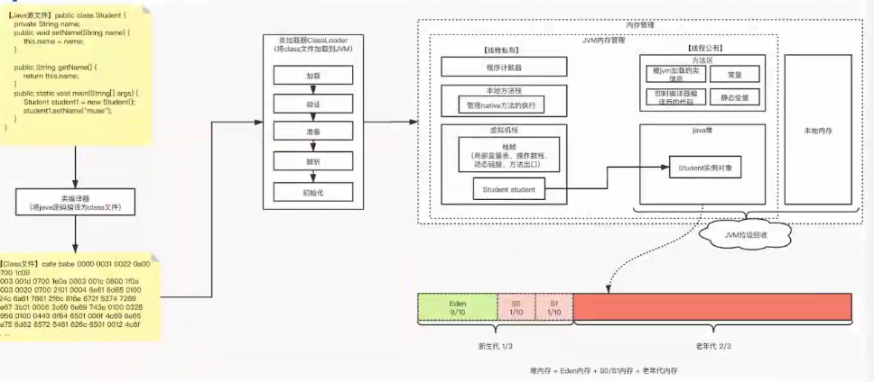
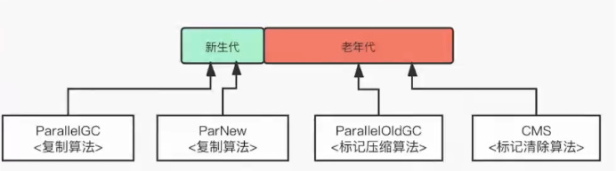

# JVM

## JVM内存模型

## JVM类加载流程和内存结构

## 类加载：classLoader

1>主动加载的方式有哪些？四种（很重要）

* Student stu=new Student();
* 反射、Clone。
* 初始化子类的时候，父类被初始化。
* 调用一个静态方法。

2>通过类的全录计划

* 加载Loader
  * 1>通过类的 全路径名，获取类的。
  * 2>解析流：将类的信息存放于发就发。 
  * 3>创造这个Class 的实例。                                                                                                                                                                                

## JVM垃圾回收器

### 垃圾回收器分类

* 串行垃圾回收器(Serial)：古老。1、只使用单线程进行GC。2、独占式的GC（STW）
* 并行垃圾回收器
* 新生代垃圾回收器
* 老年代垃圾回收器
* 单进程垃圾回收器
* 多线程垃圾回收器

#### 串行垃圾回收器-Serial

##### 串行垃圾回收器特点：

* 只使用单线程进行GC(CPU只有一个，单线程的效率比较高，因为CPU比较专注。多线程得考虑页面切换问题)
* 独占式的GC（STW,Stop-The-World，为了获取停止时的快照）

  串行收集器是JVM Client模式下默认的垃圾收集器。

##### 串行垃圾回收器回收示意图：单线程化

##### JVM参数调整：

  

##### 启用指定垃圾收集器：

##### 针对各个时期采用的算法：

#### 并行垃圾回收器-ParNew & ParallelGC& ParallelOldGc

  将串行回收器多线程化,与串行回收器有相同的回收策略、算法、参数。（Parallel：水平的意思）

#####   并行垃圾回收器回收示意图：多线程

##### 启用指定垃圾收集器：

##### 对各个时期采用的算法：

#### 并行回收器-CMS：

  CMS垃圾回收步骤:共6步：

* 初始标记：标记根对象。（STW会导致所有的线程被停止）【关键点】
* 并发标记：标记所有的对象（不那么重要的）。此时没有引发STW,不会影响到线程执行。【关键点】
* 预清理：为重新标记预备，预感下一次发生Young GC往老年代放对象的时间，取多次GC时间的中间值。
* 重新标记：标记“初始标记和“并发标记“遗漏下来的对象，可以关闭，不一定要存在。
* 并发清理：【关键点】
* 并发重置：

 #### 收集器JVM参数：

