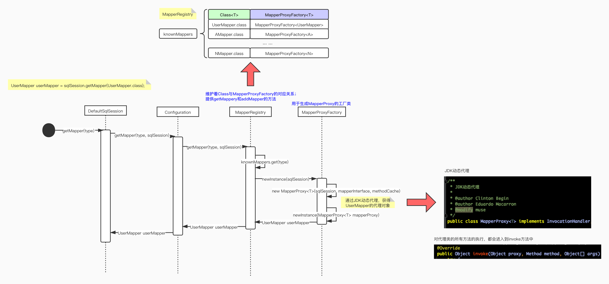
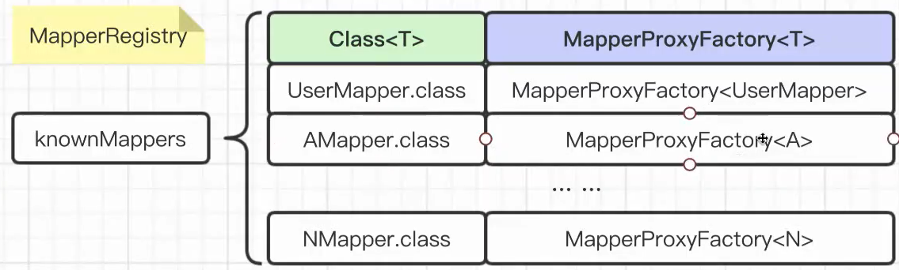
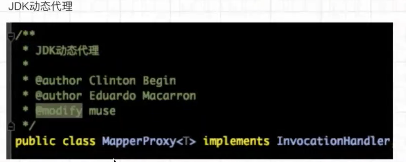

# Mybatis源码

### 阶段1、获得Mapper的动态代理阶段

先上整个流程：



一开始调用sqlSession.getMapper方法获取Mapper：这里的sqlSession对应了上图的defaultSqlSession。


调用关系

代理前：DefaultSqlSession（调用）-->Configuration（调用）-->MapperRegistry（注册器,生成newInstance）-->MapperProxyFactory（用于生成MapperProxy的工厂类）

代理后：MapperProxyFactory（用于生成MapperProxy的工厂类）-->MapperRegistry（注册器,生成newInstance）-->Configuration（调用）-->DefaultSqlSession（调用）

获取Mapper动态代理的整个过程

* MapperRegistry（mapper的注册器）：维护着Class与MapperProxyFactory的对应关系;提供getMappery和addMapper的方法。



* MapperProxyFactory（代理工厂）：生成MapperProxy，MapperProxy本质上是一个JDK的动态代理。
* MapperProxy：JDK动态代理，通过它获取UserMapper对象。 这里的InvocationHandler就是JDK的动态代理。



 进入InvocationHandler进行查看，会发现他和我们自己定义的JDK动态代理一样。


而后，直接将代理完毕的UserMapper通过MapperRegistry（注册器）传递到Configuration配置类，最后递交给sqlsession中。

**接下去，我们看一下sqlsession的源码,看之前我们在复习一下前面的过程：**

```shell
代理前：DefaultSqlSession（调用）-->Configuration（调用）-->MapperRegistry（注册器,生成newInstance）-->MapperProxyFactory（用于生成MapperProxy的工厂类）

代理后：MapperProxyFactory（用于生成MapperProxy的工厂类）-->MapperRegistry（注册器,生成newInstance）-->Configuration（调用）-->DefaultSqlSession（调用）
```

* 打开包依赖，找到mybatis源码的包--->找到session的文件夹--->找到sqlsession的接口--->从接口跳转DefaultSqlSession实现类。


* 找到getMapper方法，他对应了我们一开始获取Mapper的方法sqlSession.getMapper(UserMapper.class)，可以看到这里调用的就是我们开始写的Configuration的getMapper方法。

```java
@Override
public <T> T getMapper(Class<T> type) {
  return configuration.getMapper(type, this);
}
```

* 滑轮点击getMapper在进入下一层会发现，configuration的getMapper方法仅仅是调用了注册器的getMapper方法

```java
  public <T> T getMapper(Class<T> type, SqlSession sqlSession) {
    return mapperRegistry.getMapper(type, sqlSession);
  }
```

