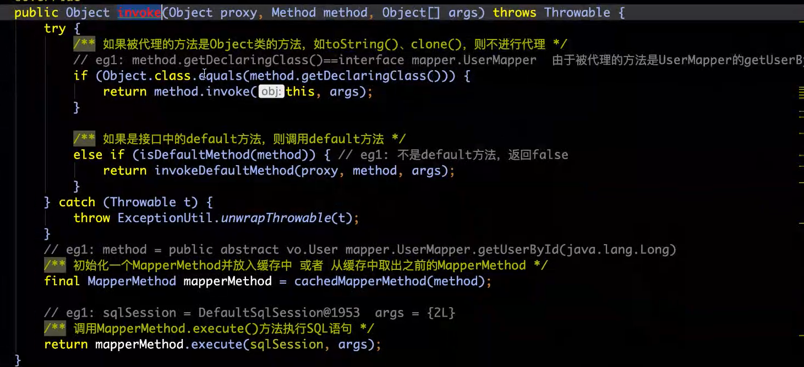

# Mybatis源码

  看源码前，先提一嘴快捷键，因为不少同学反应不知道怎么进入方法。

* 进入方法：鼠标滑轮点击方法，或者ctrl+鼠标左键
* 返回上一层方法：ctrl+alt+小键盘的←，回到下层ctrl+alt+小键盘的←

### 阶段一、获得Mapper的动态代理阶段

先上整个流程：


一开始调用sqlSession.getMapper方法获取Mapper：这里的sqlSession对应了上图的defaultSqlSession。


调用关系

代理前：DefaultSqlSession（调用）-->Configuration（调用）-->MapperRegistry（注册器,生成newInstance）-->MapperProxyFactory（用于生成MapperProxy的工厂类）

代理后：MapperProxyFactory（用于生成MapperProxy的工厂类）-->MapperRegistry（注册器,生成newInstance）-->Configuration（调用）-->DefaultSqlSession（调用）

获取Mapper动态代理的整个过程

* MapperRegistry（mapper的注册器）：维护着Class与MapperProxyFactory的对应关系;提供getMappery和addMapper的方法。


* MapperProxyFactory（代理工厂）：生成MapperProxy，MapperProxy本质上是一个JDK的动态代理。
* MapperProxy：JDK动态代理，通过它获取UserMapper对象。 这里的InvocationHandler就是JDK的动态代理。


 进入InvocationHandler进行查看，会发现他和我们自己定义的JDK动态代理一样。


而后，直接将代理完毕的UserMapper通过MapperRegistry（注册器）传递到Configuration配置类，最后递交给sqlsession中。

**接下去，我们看一下sqlsession的源码,看之前我们在复习一下前面的过程：**

```shell
代理前：DefaultSqlSession（调用）-->Configuration（调用）-->MapperRegistry（注册器,生成newInstance）-->MapperProxyFactory（用于生成MapperProxy的工厂类）

代理后：MapperProxyFactory（用于生成MapperProxy的工厂类）-->MapperRegistry（注册器,生成newInstance）-->Configuration（调用）-->DefaultSqlSession（调用）
```

* 打开包依赖，找到mybatis源码的包--->找到session的文件夹--->找到sqlsession的接口--->从接口跳转DefaultSqlSession实现类。


* 找到getMapper方法，他对应了我们一开始获取Mapper的方法sqlSession.getMapper(UserMapper.class)，可以看到这里调用的就是我们开始写的Configuration的getMapper方法。

```java
@Override
public <T> T getMapper(Class<T> type) {
  return configuration.getMapper(type, this);
}
```

* 滑轮点击getMapper在进入下一层会发现，configuration的getMapper方法仅仅是调用了注册器的getMapper方法

```java
  public <T> T getMapper(Class<T> type, SqlSession sqlSession) {
    return mapperRegistry.getMapper(type, sqlSession);
  }
```

进入注册器的getMapper：

* type=userMapper.class
* knowMappers事先已经在mybatis-config.xml配置里初始化完毕了
* 将userMapper放入knowMappers.get()中，获取Mapper的代理工厂
* 如果获取不到代理工厂则说明，userMapper.class没有找到，说明我们没有写或者没有被注册器发现，抛出异常
* 找得到则使用newInstance，初始化实例，这里我们滑轮点击进入newInstance


进入newInstance后发现有两个newInstance：

* 先使用public的，生成一个mapperProxy代理接口，然后传递给上面的newInstance
* protected的newInstance执行JDK动态代理。（JDK动态代理不懂的，可以看我的设计模式里的《代理模式》）


进入ProxyInstance，解释一下代入方法的三个变量。

* mapperInterface：用于创建实现该mapperInterface接口的代理对象，mapper接口对应的class对象。
* methodCache：是一个concurrentHashMap，用于存储方法之间的关系，就是我们写的查询和对应查询xml的关系。
  * MapperMethod对象会完成参数转换以及SQL语句的执行功能。。


解释完变量，第一阶段《Mapper的动态代理》就基本完成了。这里多提一嘴：

* 我们使用jdk动态代理获取到了userMapper，最后去使用方法的时候都会调用invoke方法。

总结：第一阶段就做了一件事，进行mapper的动态代理生成userMapper（这里的userMapper就是userMapperProxy，然后userMapper是举例，也有可能是xxxMapper）。

### 阶段二、获得MapperMethod对象

先上整个流程：


下面说的所有步骤都是围绕着我们写下的这步所做的：


我们使用的所用方法初始都会进入invoke方法，invoke方法执行步骤：

* 判断是否Object对象，是就调用Object方法，就比如是toString这种。
* 如果是default方法，则调用default方法，方法名带default的那种。
* 由于我们的方法都不满足，所以都不返回，执行下一步：
  * 获取MapperMethod实例，使用MapperMethod实例执行方法。

接下去，我们进入CachedMapperMethod查看是如何获取mapperMethod实例的。



