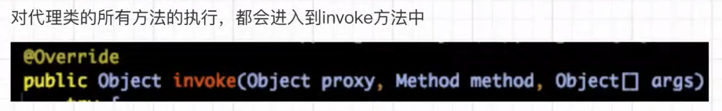

# Mybatis源码

  看源码前，先提一嘴快捷键，因为不少同学反应不知道怎么进入方法。

* 进入方法：鼠标滑轮点击方法，或者ctrl+鼠标左键
* 返回上一层方法：ctrl+alt+小键盘的←，回到下层ctrl+alt+小键盘的←

### 阶段一、获得Mapper的动态代理阶段

先上整个流程：


一开始调用sqlSession.getMapper方法获取Mapper：这里的sqlSession对应了上图的defaultSqlSession。


调用关系

代理前：DefaultSqlSession（调用）-->Configuration（调用）-->MapperRegistry（注册器,生成newInstance）-->MapperProxyFactory（用于生成MapperProxy的工厂类）

代理后：MapperProxyFactory（用于生成MapperProxy的工厂类）-->MapperRegistry（注册器,生成newInstance）-->Configuration（调用）-->DefaultSqlSession（调用）

获取Mapper动态代理的整个过程

* MapperRegistry（mapper的注册器）：维护着Class与MapperProxyFactory的对应关系;提供getMappery和addMapper的方法。


* MapperProxyFactory（代理工厂）：生成MapperProxy，MapperProxy本质上是一个JDK的动态代理。
* MapperProxy：JDK动态代理，通过它获取UserMapper对象。 这里的InvocationHandler就是JDK的动态代理。


 进入InvocationHandler进行查看，会发现他和我们自己定义的JDK动态代理一样。



而后，直接将代理完毕的UserMapper通过MapperRegistry（注册器）传递到Configuration配置类，最后递交给sqlsession中。

**接下去，我们看一下sqlsession的源码,看之前我们在复习一下前面的过程：**

```shell
代理前：DefaultSqlSession（调用）-->Configuration（调用）-->MapperRegistry（注册器,生成newInstance）-->MapperProxyFactory（用于生成MapperProxy的工厂类）

代理后：MapperProxyFactory（用于生成MapperProxy的工厂类）-->MapperRegistry（注册器,生成newInstance）-->Configuration（调用）-->DefaultSqlSession（调用）
```

* 打开包依赖，找到mybatis源码的包--->找到session的文件夹--->找到sqlsession的接口--->从接口跳转DefaultSqlSession实现类。


* 找到getMapper方法，他对应了我们一开始获取Mapper的方法sqlSession.getMapper(UserMapper.class)，可以看到这里调用的就是我们开始写的Configuration的getMapper方法。

```java
@Override
public <T> T getMapper(Class<T> type) {
  return configuration.getMapper(type, this);
}
```

* 滑轮点击getMapper在进入下一层会发现，configuration的getMapper方法仅仅是调用了注册器的getMapper方法

```java
  public <T> T getMapper(Class<T> type, SqlSession sqlSession) {
    return mapperRegistry.getMapper(type, sqlSession);
  }
```

进入注册器的getMapper：

* type=userMapper.class
* knowMappers事先已经在mybatis-config.xml配置里初始化完毕了
* 将userMapper放入knowMappers.get()中，获取Mapper的代理工厂
* 如果获取不到代理工厂则说明，userMapper.class没有找到，说明我们没有写或者没有被注册器发现，抛出异常
* 找得到则使用newInstance，初始化实例，这里我们滑轮点击进入newInstance


进入newInstance后发现有两个newInstance：

* 先使用public的，生成一个mapperProxy代理接口，然后传递给上面的newInstance
* protected的newInstance执行JDK动态代理。（JDK动态代理不懂的，可以看我的设计模式里的《代理模式》）


进入ProxyInstance，解释一下代入方法的三个变量。

* mapperInterface：用于创建实现该mapperInterface接口的代理对象，mapper接口对应的class对象。
* methodCache：是一个concurrentHashMap，用于存储方法之间的关系，就是我们写的查询和对应查询xml的关系。
  * MapperMethod对象会完成参数转换以及SQL语句的执行功能。。


解释完变量，第一阶段《Mapper的动态代理》就基本完成了。这里多提一嘴：

* 我们使用jdk动态代理获取到了userMapper，最后去使用方法的时候都会调用invoke方法。

总结：第一阶段就做了一件事，进行mapper的动态代理生成userMapper（这里的userMapper就是userMapperProxy，然后userMapper是举例，也有可能是xxxMapper）。

### 阶段二、获得MapperMethod对象

先上整个流程：


下面说的所有步骤都是围绕着我们写下的这步所做的：


我们使用的所用方法初始都会进入invoke方法，invoke方法执行步骤：

* 判断是否Object对象，是就调用Object方法，就比如是toString这种。
* 否则执行cachedInvoker方法。

接下去，我们进入cachedInvoker查看是如何获取mapperMethod实例的。


​	根据被调用接口方法的Method对象，从缓存中获取MapperMethodInvoker对象，如果没有则创建一个并放入缓存。然后会判断用户当前调用的是否是接口的default方法，如果不是就会创建一个PlainMethodInvoker对象并返回。我们进入cachedInvoker方法查看：

* 首先使用MapUtil的computeIfAbsent方法判断传入的方法是否为空，这里介绍下这个方法：

  * 这个方法会把传入的method拿去查找，得到对应的值

    * 如果值为空，则将经过Function处理过的method方法放入为值
    * 如果不为空，则返回method对应的key值

    这个方法非常巧妙，使用了FP的思想，第二层使用了方法引用，最后一层调用顶层方法进行处理回调，大家有空可以看看。

  * 介绍lambda表达式所写内容

    * 首先判断传入方法是否为默认方法，判断方法如下：
      * (判断方法修饰符是否为空)&(方法修饰符是否为abstract|public|static其中之一)&判断是否为接口，都为真则返回true。
      * 判断是否有*privateLookupInMethod* 方法，该方法是java9才有的方法，所以是为了判断你java版本的，根据你java的版本调用对应的DefaultMethodInvoker方法。
    * 如果不是默认方法，则使用一个PlainMethodInvoker来装载MapperMethod。

总结一下：cachedInvoker就是用来判断我们要用的方法在不在缓存Map里存着，有的话存返回对应方法，没有就根据方法的类型进行返回。

下面我们返回上一层，就是invoke这层，会发现我们返回了方法后，立马调用了cachedInvoker的invoke方法，滑轮点击cachedInvoker的invoke方法，我们继续深入：

```java
private MapperMethodInvoker cachedInvoker(Method method) throws Throwable {
  try {
    return MapUtil.computeIfAbsent(methodCache, method, m -> {
      if (m.isDefault()) { //判断是否为默认方法
        try {
          if (privateLookupInMethod == null) { //判断当前的jdk版本
            return new DefaultMethodInvoker(getMethodHandleJava8(method));
          } else {
            return new DefaultMethodInvoker(getMethodHandleJava9(method));
          }
        } catch (IllegalAccessException | InstantiationException | InvocationTargetException
            | NoSuchMethodException e) {
          throw new RuntimeException(e);
        }
      } else { //如果不是默认方法则调用PlainMethodInvoker装载mapperMethod
        return new PlainMethodInvoker(new MapperMethod(mapperInterface, method, sqlSession.getConfiguration()));
      }
    });
  } catch (RuntimeException re) {
    Throwable cause = re.getCause();
    throw cause == null ? re : cause;
  }
}
```

怎么判断是不是default方法：

 

进入cachedInvoker的invoke方法：会发现他是一个接口，我们去看一下他的实现类：

* DefaultMethodInvoker，上面cachedInvoker部分看到的默认方法的处理方式
* PlainMethodInvoker，上面cachedInvoker部分看到的非默认方法的处理方式

这里我们滑轮进入PlainMethodInvoker类，查看invoke方法，因为我们写入的Mapper对应的sql都不是默认方法。

```java
interface MapperMethodInvoker {
  Object invoke(Object proxy, Method method, Object[] args, SqlSession sqlSession) throws Throwable;
}
```

进入PlainMethodInvoker类后，直奔invoke方法，介绍下传入参数：

* 

```java
@Override
public Object invoke(Object proxy, Method method, Object[] args, SqlSession sqlSession) throws Throwable {
  return mapperMethod.execute(sqlSession, args);
}
```

​	进入mapperMethod查看execute方法，可以看到还很简单，就是switch判断类型，然后怼对应的方法，这里我们选一个INSERT来重点说，然后你就会问了，为什么不选SELECT来说，看着好像很复杂，其实一点都不复杂，而是因为SELECT分成了很多情况，比如集合、map、单个对象，我不好细说，所以讲个INSERT大家触类旁通即可：（SELECT对应部分注释，我也给出来了。）

* 使用command的getType方法获取操作的方法，并且用switch执行对应方法，这里假设进入INSERT方法：
  * 使用MethodSignature对传入的参数agrs进行参数转换。
  * 转换成对象元素后放入sqlSession进行查询，查询完毕后使用rowCountResult封装，然后返回结果。

这里重点来讲下SqlCommand和MethodSignature两个类怎么去实现我写在注释里的功能的。

```java
  private final SqlCommand command; //负责获取Dao中的名字、判断使用的数据库、判断要进行的数据操作方式：例如insert等
  private final MethodSignature method;//判断返回值是什么类型：例如，集合、Map、Void、或者Class实例等。

  public MapperMethod(Class<?> mapperInterface, Method method, Configuration config) {
    this.command = new SqlCommand(config, mapperInterface, method);
    this.method = new MethodSignature(config, mapperInterface, method);
  }
public Object execute(SqlSession sqlSession, Object[] args) {
  Object result;
  switch (command.getType()) { //执行方法判断
    case INSERT: {
      Object param = method.convertArgsToSqlCommandParam(args);//参数转换
      result = rowCountResult(sqlSession.insert(command.getName(), param));//SQL执行
      break;
    }
    case UPDATE: {
      Object param = method.convertArgsToSqlCommandParam(args);
      result = rowCountResult(sqlSession.update(command.getName(), param));
      break;
    }
    case DELETE: {
      Object param = method.convertArgsToSqlCommandParam(args);
      result = rowCountResult(sqlSession.delete(command.getName(), param));
      break;
    }
    case SELECT:
        //1.返回void
      if (method.returnsVoid() && method.hasResultHandler()) {
        executeWithResultHandler(sqlSession, args);
        result = null;
        //2.返回集合
      } else if (method.returnsMany()) {
        result = executeForMany(sqlSession, args);
        //3.返回map
      } else if (method.returnsMap()) {
        result = executeForMap(sqlSession, args);
        //4.返回游标
      } else if (method.returnsCursor()) {
		//5.返回单个对象
        result = executeForCursor(sqlSession, args);
      } else {
        Object param = method.convertArgsToSqlCommandParam(args);
        result = sqlSession.selectOne(command.getName(), param);
        if (method.returnsOptional()
            && (result == null || !method.getReturnType().equals(result.getClass()))) {
          result = Optional.ofNullable(result);
        }
      }
      break;
    case FLUSH:
      result = sqlSession.flushStatements();
      break;
    default:
      throw new BindingException("Unknown execution method for: " + command.getName());
  }
  if (result == null && method.getReturnType().isPrimitive() && !method.returnsVoid()) {
    throw new BindingException("Mapper method '" + command.getName()
        + " attempted to return null from a method with a primitive return type (" + method.getReturnType() + ").");
  }
  return result;
}
```

进入SqlCommand类中：

* 参数介绍：
  * name：Dao层方法名
  * type：操作类型，例如UNKNOWN, INSERT, UPDATE, DELETE, SELECT, FLUSH
* SqlCommand具体步骤：
  * 获取要进行操作的操作名
  * 获得方法声明的接口类型
  * 根据xml中的每个方法构建的MappedStatement 
  * 如果没有获取到，则查看是否为刷新，是的话名字置空，类型转为刷新。不是刷新还为空，就报错。
  * 如果不为空，则获取对应的对象id和对应操作类型。
  * 如果是UNKNOWN，则抛出异常。

```java
 public static class SqlCommand {
     //Dao层方法名
    private final String name; 	
     // 操作的类型：SqlCommandType内只有UNKNOWN, INSERT, UPDATE, DELETE, SELECT, FLUSH，六个变量。
    private final SqlCommandType type;
     
    public SqlCommand(Configuration configuration, Class<?> mapperInterface, Method method) {
      //获取要进行操作的操作名：UNKNOWN, INSERT, UPDATE, DELETE, SELECT, FLUSH
      final String methodName = method.getName();
      //获得方法声明的接口类型，表示类或接口的Class对象。
      final Class<?> declaringClass = method.getDeclaringClass();
      //根据这个获取mybatis初始化时为xml中的每个方法构建的MappedStatement  里面主要存储该sql的信息 
      MappedStatement ms = resolveMappedStatement(mapperInterface, methodName, declaringClass,
          configuration);
        
      if (ms == null) {
        if (method.getAnnotation(Flush.class) != null) {
          name = null;
          type = SqlCommandType.FLUSH;
        } else {
          throw new BindingException("Invalid bound statement (not found): "
              + mapperInterface.getName() + "." + methodName);
        }
      } else {
        name = ms.getId();
        type = ms.getSqlCommandType();
        if (type == SqlCommandType.UNKNOWN) {
          throw new BindingException("Unknown execution method for: " + name);
        }
      }
    }
    public SqlCommandType getType() {
      return type;
    }
```

​	

* 执行流程如下，这两个图是连起来的


总结：查找操作类型，判断传来的方法是什么操作类型。

进入MethodSignature方法中查看：

​	主要就是为了判断返回的数据类型，例如，集合、Map、Void、或者Class实例等。

```java
public MethodSignature(Configuration configuration, Class<?> mapperInterface, Method method) {
  //该方法返回类型    
  Type resolvedReturnType = TypeParameterResolver.resolveReturnType(method, mapperInterface);
  if (resolvedReturnType instanceof Class<?>) {
    this.returnType = (Class<?>) resolvedReturnType;
  } else if (resolvedReturnType instanceof ParameterizedType) {
    this.returnType = (Class<?>) ((ParameterizedType) resolvedReturnType).getRawType();
  } else {
    this.returnType = method.getReturnType();
  }
  //是否返回空
  this.returnsVoid = void.class.equals(this.returnType);
  //是否返回多个数据 
  this.returnsMany = configuration.getObjectFactory().isCollection(this.returnType) || this.returnType.isArray();
  //是否返回的是Cursor类型
  this.returnsCursor = Cursor.class.equals(this.returnType);
  //是否返回的是Optional类型
  this.returnsOptional = Optional.class.equals(this.returnType);
  //获取到mapKey 即@MapKey值
  this.mapKey = getMapKey(method);
  //是否返回map
  this.returnsMap = this.mapKey != null;
  //参数中是否有RowBounds  即mybatis的分页工具类
  this.rowBoundsIndex = getUniqueParamIndex(method, RowBounds.class);
  //是否有ResultHandler类
  this.resultHandlerIndex = getUniqueParamIndex(method, ResultHandler.class);
  //获取到参数值  即@Param的值，如果有则为里面的value值  如果没有 则为'0','1','2'之类的
  this.paramNameResolver = new ParamNameResolver(configuration, method);
}
```

假定我们要获取的是自定义的一个对象，那么我们会使用this.paramNameResolver这个方法：

	为什么是二维数组，因为我们对传入的参数可以使用@Param传入，而传入的对象前可以有多个注解，所以是二维数组：

	

执行流程图如下：


再回到之前的INSERT方法：

* 使用MethodSignature的方法将args数组转换成我们需要获取的数据类型。
* 传入方法名和需要返回的对应元素类型。

最后一步，执行sqlSession的insert方法，映射到对应的xml

```java
case INSERT: {
  //使用MethodSignature的方法将args数组转换成我们需要获取的数据类型。
  Object param = method.convertArgsToSqlCommandParam(args);
  //传入方法名和需要返回的对应元素类型。
  result = rowCountResult(sqlSession.insert(command.getName(), param));
  break;
}
```

至此Mybatis框架运行时第二阶段获取MapperMethod对象结束。

### 阶段三、mapperMethod的execute执行流程

先上图，对第三阶段要讲解的过程有个全面认识：


一切从这里开始：

* sqlsession:配置类
* args：传出参数的类型


接着进入sqlCommand.getType()判断是什么类型，这里给大家看下这个类型有几种：

```java
public enum SqlCommandType {
  UNKNOWN, INSERT, UPDATE, DELETE, SELECT, FLUSH
}
```

INSERT, UPDATE, DELETE这三种方法的流程是一样的，因为上一阶段也讲过INSERT了，这里在讲讲UPDATE：

接着，讲一下SELECT方法：这里假设我们要使用的方法是userMapper.getUserById();

```java
case SELECT:
  if (method.returnsVoid() && method.hasResultHandler()) { //判断是否ResultHandler或者void类型
    executeWithResultHandler(sqlSession, args);
    result = null;
  } else if (method.returnsMany()) { //判断是否返回为数组或者集合
    result = executeForMany(sqlSession, args);
  } else if (method.returnsMap()) { //判断返回是否map类型
    result = executeForMap(sqlSession, args);
  } else if (method.returnsCursor()) { //判断返回是否cursor类型
    result = executeForCursor(sqlSession, args);
  } else {   //都不是则获得属性名和入参的映射关系
    Object param = method.convertArgsToSqlCommandParam(args); //都不是则获得属性名和入参的映射关系
    result = sqlSession.selectOne(command.getName(), param);  //执行sql的查询语句
    if (method.returnsOptional()
        && (result == null || !method.getReturnType().equals(result.getClass()))) {
      result = Optional.ofNullable(result);
    }
  }
  break;
```


