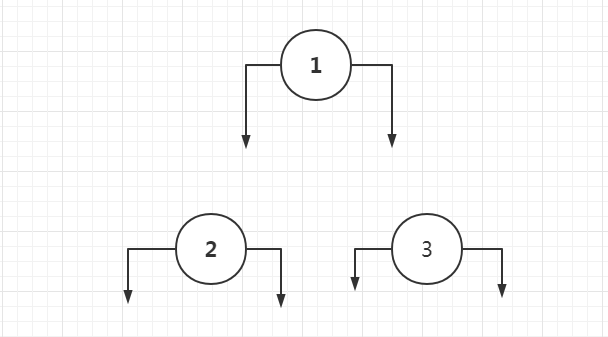
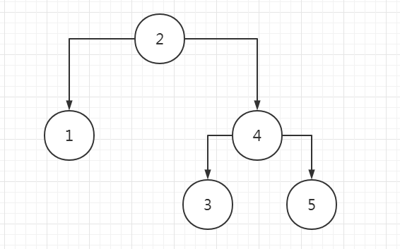
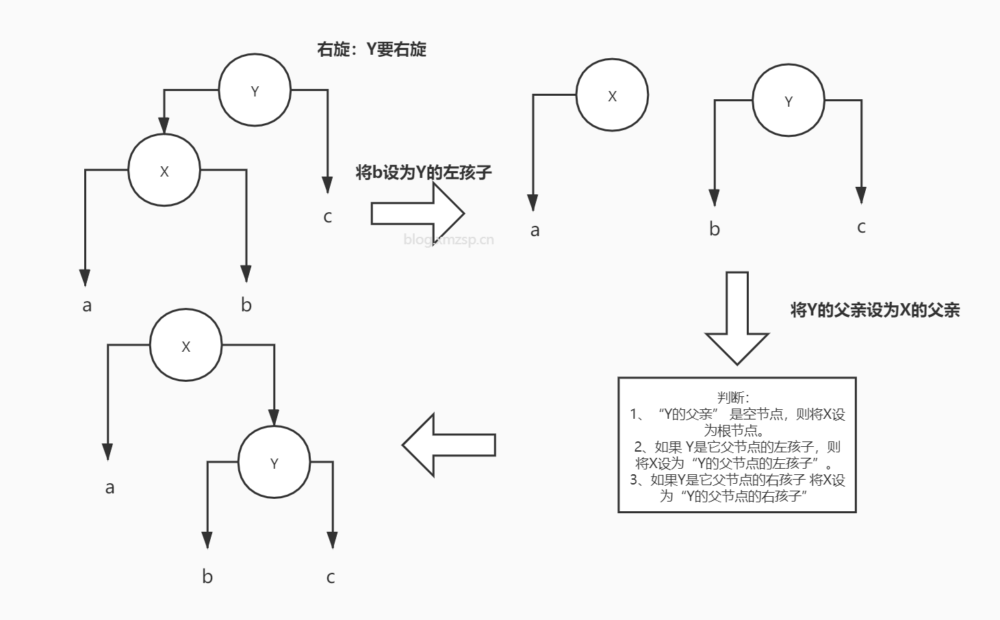
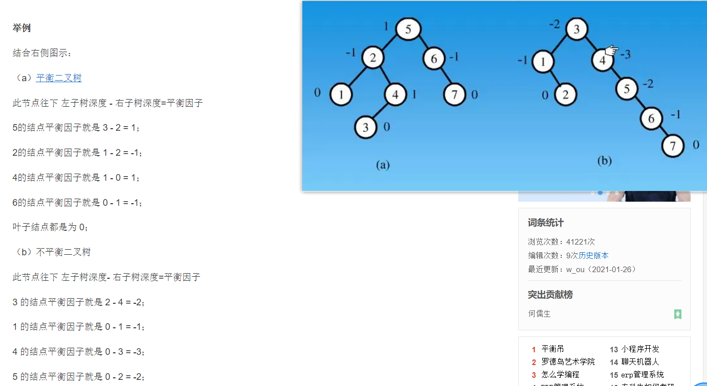
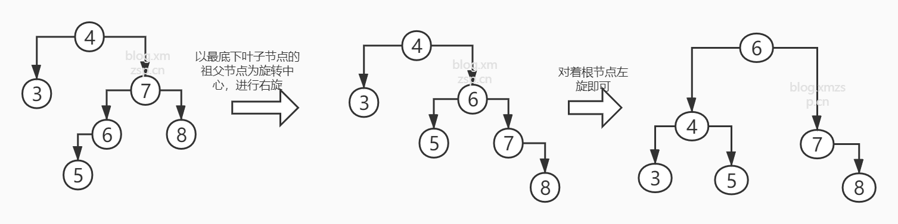
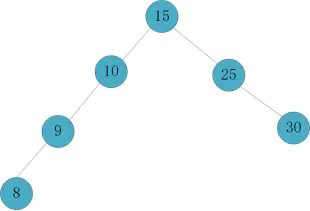

# 树的演变

  本文会和你介绍树的演变过程，从二叉树->二叉查找树->平衡二叉树(AVL树)->b-树->b+树（MySQL索引）->红黑树（BR树，1.8HashMap，这里可以提一下23树，把23树对应红黑树来讲），以上并非是二叉树的演变过程，而是我从复杂程度过来区分的，所有的树都各有各的好处，接下去由我来分别介绍。


## 二叉树

​    我们经常谈论的树，都是以二叉树为起点，然后添加各种规则去实现查找时间或者空间的减少。二叉树，是很平常的一颗“倒过来”的树，单单用来存储数据，如下图，因为不涉及查找，所以数字可以乱放：


  然后我们来手写一个树的类，来模拟一下这个二叉树：很简单，一个树有左右结点，然后值。

```java
public class TreeNode {
    private TreeNode leftTreeNode;
    private TreeNode rightTreeNode;
    private int value;
}

```

然后给上set和构造方法：

```java
public class TreeNode {
    private TreeNode leftTreeNode;
    private TreeNode rightTreeNode;
    private int value;
    public TreeNode(int value) {
        this.value = value;
    }
    public void setLeftTreeNode(TreeNode leftTreeNode) {
        this.leftTreeNode = leftTreeNode;
    }

    public void setRightTreeNode(TreeNode rightTreeNode) {
        this.rightTreeNode = rightTreeNode;
    }
}
```

接下去我们使用它：

```java
public class TreeDemo {
    public static void main(String[] args) {
        TreeNode treeNode1 = new TreeNode(1);
        TreeNode treeNode2 = new TreeNode(2);
        TreeNode treeNode3 = new TreeNode(3);
    }
}
```

  现在的情况如图：



  然后以1作为起点脸上其他结点就变成了我们刚开始看到的图：

```java
   public class TreeDemo {
    public static void main(String[] args) {
        TreeNode treeNode1 = new TreeNode(1);
        TreeNode treeNode2 = new TreeNode(2);
        TreeNode treeNode3 = new TreeNode(3);
        treeNode1.setLeftTreeNode(treeNode2);
        treeNode1.setRightTreeNode(treeNode3);
    }
}
```

  ### 遍历二叉树（先序、中序、后序遍历）

  二叉树是一种数据结构，主要还是用来存储数据的，既然树做好了，我们下面来讲讲怎么遍历把，

遍历方法分为三种，以根为划分依据分为：

* 先序遍历：先遍历根结点，然后左节点，右结点。（根左右）

* 中序遍历：先遍历左结点，然后根节点，右结点。（左根右）

* 后序遍历：先遍历左结点，然后右节点，根结点。（左右根）

  一句话，当找到一个新结点时，把这个结点当成新的根，去找他的孩子，如果没有孩子，再去根据选择的遍历顺序取值，我这里举个栗子：


```shell
先序遍历：ABDFCEGHI
中序遍历：BFDACHGIE
后序遍历：FDBHIGECA
```

  比如说我这个中序怎么出来的？中序是左根右，那么我们先把根当成第一个结点：

* 根A的左边为B，我们优先进入B。
* 然后B是新的根，B的左边没有数，然后右边是D，我们进入D。此时顺序为：B
* 把D当成新的根，则左子树为F，且F下没有子树了，而根为D，所以得到顺序为:BFD。
* 然后左子树遍历完毕后，回到根，得到A。目前为：BFDA
* 左根右的左和根遍历完了，我们接下去遍历右。
* 进入C，此时的C为新的根，由于没有左子树，所以我们得到C，此时为：BFDAC
* 进入E，E有左子树G，而G也有左子树，所以此时G为新根，左根右，此时为:BFDACHGI

* 返回E，此时E为根，由于左子树遍历完了，所以走根，得到E。此时为:BFDACHGIE

  其他的可以自己再试试，接下来我们来代码实现一下后序遍历：

```java
    public static void LRD(TreeNode rootTreeNode){
        if (rootTreeNode!=null){
            LRD(rootTreeNode.getLeftTreeNode());
            LRD(rootTreeNode.getRightTreeNode());
            System.out.print(rootTreeNode.getValue()+"--");
        }
    }  
```

  然后使用方法遍历它： 

```java
public class TreeDemo {
    public static void main(String[] args) {
        LRD(A);
        System.out.println("author:zsp");
    }
```

  如果需要我代码的同学可以到我github查看：[找数据结构文件夹的src下](https://github.com/270520006/java-advanced)，输出结果如下：


## 二叉查找树 

### 二叉查找树定义

  上面就是一个普通的二叉树，我们创建出来以后随便连接。接下来我们来给他加点规则让他成为二叉查找树：

* 若**左子树**不为空，则左子树上**所有节点**的值均**小于或等于**它的根节点的值。
* 若**右子树**不为空，则右子树上**所有节点**的值均**大于或等于**它的根结点的值。
* 根据这个性质，对一个二叉树进行**中序遍历**，如果是单调递增的，则可以说明这个树是二叉搜索树。

  最后这条是我自己加的，用于大家校验自己写的是否是正确的二叉查找树。二叉查找树的示意图如下：



  这里先创建一个根的类：

```java
/**
 * 创建一个TreeRoot来代表根，本质上TreeRoot也还是TreeNode
 */
public class TreeRoot {
    private TreeNode treeRoot;
    public TreeNode getTreeRoot() {
        return treeRoot;
    }
    public void setTreeRoot(TreeNode treeRoot) {
        this.treeRoot = treeRoot;
    }
}
```

  然后进行树的创建编写，大于放右边，小于放左边：

```java
    public static void CreateTree(TreeRoot treeRoot,int  value){
        if (treeRoot.getTreeRoot()==null){ //如果传过来的树根为空，说明是第一个元素
            TreeNode treeNode = new TreeNode(value); //创建树结点，成为第根节点
            treeRoot.setTreeRoot(treeNode);
        }
        else{ //否则，说明是第二个元素
            TreeNode temRoot = treeRoot.getTreeRoot();//创建临时结点，防止出现树下有孩子
            while(treeRoot!=null){ //无限遍历，一直找到叶子结点的下位，就不找了
                if (value>temRoot.getValue()){ //大于放右边
                    if (temRoot.getRightTreeNode()==null){//查看结点是否为叶子结点
                        temRoot.setRightTreeNode(new TreeNode(value));
                        return;
                    }
                    else //有值，说明下面还有结点
                    {
                        temRoot=temRoot.getRightTreeNode();
                    }
                }else //小于放左边
                {
                    if (temRoot.getLeftTreeNode()==null){
                        temRoot.setLeftTreeNode(new TreeNode(value));
                        return;
                    }else{
                        temRoot=temRoot.getLeftTreeNode();
                    }
                }
            }
        }
    }
```

  测试一下：

```java
public class TreeDemo {
    public static void main(String[] args) {
        List<Integer> list = new ArrayList<>(5);//模拟要放入的数据
        list.add(2); list.add(1);list.add(4); list.add(3); list.add(5);
        TreeRoot treeRoot = new TreeRoot();//创建一颗树出来
        for (Integer one : list) { //依次存入树
            CreateTree(treeRoot,one);
        }
        System.out.println("中序遍历的结果是：");
        //将结果遍历出来，这里的中序遍历，大家仿照我写的后序遍历自己写一个
        LDR(treeRoot.getTreeRoot());
        System.out.println("author:zsp");
    }
```

  运行截图：


### 二叉查找树优点及缺点

#### 优点

* **二叉排序树是一种比较有用的折衷方案**。二叉排序树就既有链表的好处,也有数组的好处。
  * 数组的搜索比较方便,可以直接用下标,但删除或者插入某些元素就比较麻烦。
  * 链表与之相反,删除和插入元素很快,但查找很慢。

#### 缺点

* 对于顺序存储而言，它的数据结构会变成单一分支，类似于（或者就是）链表。
  * 比如存储1、2、3、4、5，所有的树都会堆积在1的右子树。


## 平衡二叉树

### 平衡二叉树定义

  平衡二叉树又称之为**AVL树**，它也是一棵二叉查找树，所以我们判断一棵树是不是平衡二叉树就可以看以下两点：

* 必须是二叉查找树。

* 每个节点的左子树和右子树的**高度**差至多为1。

​    举例说明一下高度相差超过1的情况，如图：


  2到1的高度为2，而2到2.5的高度为4，相差2，就不是平衡树。下图也是：


  节点4的右子树高度为3，而左子树，只有1，那么高度差就是2，也不是平衡树。

  为了处理这种情况出现，出现了平衡变换的两种方法，左旋和右旋。

### 平衡的方法：左旋/右旋

#### 左旋

步骤如下：（左旋左子树，改变左子树，并变成左子树）

* 先将Y的｛左｝子树给X。
* 将X父亲给Y ，这时候有三种情况，如图所示。
* 最后完成了左旋。


#### 右旋

步骤如下：（右旋,改变右子树，并变成右子树）

* 先将X的｛右｝子树给Y。
* 将Y父亲给X ，这时候有三种情况，如图所示。
* 最后完成了右旋。



足够细心的话会发现，左右旋是对称的，即左旋以后再右旋就能回到原本的样子。

* 左旋就提旋转目标的右子树上去，使自身变成右子树。

* 右旋就提旋转目标的左子树上去，使自身变成左子树。

  举例：以下都以X为旋转目标：


### 平衡因子

  学习平衡二叉树的过程中会引出一个新的名词：平衡因子。平衡二叉树上所有节点的平衡因子只可能是-1,0或1。

  **平衡因子 = 左子树深度 - 右子树深度**



  这一块摘抄自百度百科，深度的计算就是把根节点不算，然后算左右子树最长节点之差。

  基础部分都讲完了，来讲下重头戏，插入和删除后平衡树怎么再次保持平衡。

### 平衡变换：插入/删除（重点）

#### 插入

  插入相较于删除而言更为简单，只需要将插入后分为四种情况即可。

##### RR型（右子树的右子树超出）

  遇到RR型，脑子可以直接丢掉，直接对着根节点左旋即可。（记住RR就是两个right，对着根节点左旋），如下图举例：


  可以看到此时的4到8有四个节点，而4到3只有两个，所以高度超出了1，对4进行右旋。

##### LL型（左子树的左子树超出）

  同上，这里是对着根节点右旋即可，（反着旋即可）。


##### RL型（右子树的左子树超出）

  我们对付这种复杂的形状，都是想办法将他们转换成RR或者LL型来处理的。比如RL型，我们分为以下两步：

* 以**最底下叶子节点的祖父节点**为旋转中心，进行右旋，这时候RL型就变成了RR型。
* 以RR型的处理方法处理它。



##### LR型（左子树的右子树超出）

  我们对付这种复杂的形状，都是想办法将他们转换成RR或者LL型来处理的。比如RL型，我们分为以下两步：

* 以**最底下叶子节点的祖父节点**为旋转中心，进行左旋，这时候LR型就变成了LL型。
* 以LL型的处理方法处理它。


#### 删除

​	删除比插入要稍微复杂一点，因为删除后的平衡还需要使用插入的四种情况，这里我把删除分为三种情况：

* 删除的节点为叶子节点。
* 删除的节点有单个子树。
* 删除的节点有两个子树。

##### 删除的节点为叶子节点

  我把这种情况要做的步骤分为两步：

* 先删除叶子节点。
* 根据删除后的叶子节点情况，对其父节点平衡情况进行检索，如果没有发生变化，则向上这个操作一直到根节点。
* 对发生失衡的节点进行RR/LL/RL/LR型的处理，当然如果都没有失衡，那就不用处理。

  这里就举个例子把，不列举所有情况了，比如我们要删除的是7这个元素。


  删除后变成了这样：


  此时就变成了RL型的情况，然后就根据插入的时候RL型的方法去处理即可，最后得到：


##### 删除的有单个子树（左/右子树）

* 删除节点后，删除节点的孩子节点会成为**继承节点**（代替父类位置的节点称之为孩子节点）。

* 根据删除后的节点情况，对其新父节点平衡情况进行检索，如果没有发生变化，则向上这个操作一直到根节点。
* 对发生失衡的节点进行RR/LL/RL/LR型的处理，当然如果都没有失衡，那就不用处理。

  举个例子，比如这里我们删除40这个节点：


  那么50成为继承节点后，就变成了LR型：


  对其进行LR型操作后，平衡树得到了平衡，再次强调，一定要把插入的四种形态看完再来看删除：


##### 删除有双子树的节点

  你一定会在想，我们上面学的平衡因子干嘛用的，这里就要用到了，我将删除有双子树的节点分为以下几步：

* 如果该节点平衡因子为0或者1，说明左子树比较长，那么我们从左子树的最右边找到继承节点，代替被删除的节点。
* 如果该节点平衡因子为-1，则说明右子树比较长，那么我们从右子树的最左边，找到继承节点，代替被删除的节点。
* 根据删除后的节点情况，对其新父节点平衡情况进行检索，如果没有发生变化，则向上这个操作一直到根节点。
* 对发生失衡的节点进行RR/LL/RL/LR型的处理，当然如果都没有失衡，那就不用处理。

  接下来举个例子，比如我们要删除的是20这个节点：


  可以发现20的平衡因子应为1，那么我们找到左子树的最右边15，让他和20替换。


  删除20后，发现节点10出现了LR的情况，先对8进行左旋：



  对10进行右旋操作后，检查父级节点，发现都平衡了。至此，完成了对20的删除操作。


  至此平衡树的平衡全部书写完毕，代码实现我可能过几天再更新上，最近在准备面试，比较忙。