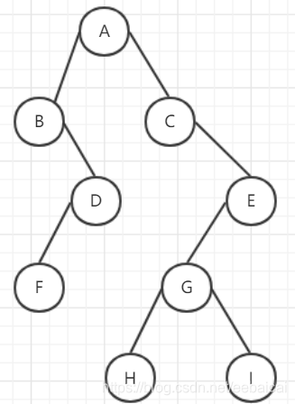

# 树的演变

  本文会和你介绍树的演变过程，从二叉树->二叉查找树->平衡二叉树(AVL树)->b-树->b+树（MySQL索引）->红黑树（BR树，1.8HashMap，这里可以提一下23树，把23树对应红黑树来讲），以上并非是二叉树的演变过程，而是我从复杂程度过来区分的，所有的树都各有各的好处，接下去由我来分别介绍。


## 二叉树

​    我们经常谈论的树，都是以二叉树为起点，然后添加各种规则去实现查找时间或者空间的减少。二叉树，是很平常的一颗“倒过来”的树，单单用来存储数据，如下图，因为不涉及查找，所以数字可以乱放：


  然后我们来手写一个树的类，来模拟一下这个二叉树：很简单，一个树有左右结点，然后值。

```java
public class TreeNode {
    private TreeNode leftTreeNode;
    private TreeNode rightTreeNode;
    private int value;
}

```

然后给上set和构造方法：

```java
public class TreeNode {
    private TreeNode leftTreeNode;
    private TreeNode rightTreeNode;
    private int value;
    public TreeNode(int value) {
        this.value = value;
    }
    public void setLeftTreeNode(TreeNode leftTreeNode) {
        this.leftTreeNode = leftTreeNode;
    }

    public void setRightTreeNode(TreeNode rightTreeNode) {
        this.rightTreeNode = rightTreeNode;
    }
}
```

接下去我们使用它：

```java
public class TreeDemo {
    public static void main(String[] args) {
        TreeNode treeNode1 = new TreeNode(1);
        TreeNode treeNode2 = new TreeNode(2);
        TreeNode treeNode3 = new TreeNode(3);
    }
}
```

  现在的情况如图：


  然后以1作为起点脸上其他结点就变成了我们刚开始看到的图：

```java
   public class TreeDemo {
    public static void main(String[] args) {
        TreeNode treeNode1 = new TreeNode(1);
        TreeNode treeNode2 = new TreeNode(2);
        TreeNode treeNode3 = new TreeNode(3);
        treeNode1.setLeftTreeNode(treeNode2);
        treeNode1.setRightTreeNode(treeNode3);
    }
}
```

  ### 遍历二叉树

  二叉树是一种数据结构，主要还是用来存储数据的，既然树做好了，我们下面来讲讲怎么遍历把，

遍历方法分为三种，以根为划分依据分为：

* 先序遍历：先遍历根结点，然后左节点，右结点。（根左右）
* 中序遍历：先遍历左结点，然后根节点，右结点。（左根右）
* 后序遍历：先遍历左结点，然后右节点，根结点。（左右根）

  一句话，当找到一个新结点时，把这个结点当成新的根，去找他的孩子，如果没有孩子，再去根据选择的遍历顺序取值，我这里举个栗子：



```shell
先序遍历：ABDFCEGHI
中序遍历：BFDACHGIE
后序遍历：FDBHIGECA
```

  比如说我这个中序怎么出来的？中序是左根右，那么我们先把根当成第一个结点：

* 根A的左边为B，我们优先进入B。
* 然后B是新的根，B的左边没有数，然后右边是D，我们进入D。此时顺序为：B
* 把D当成新的根，则左子树为F，且F下没有子树了，而根为D，所以得到顺序为:BFD。
* 然后左子树遍历完毕后，回到根，得到A。目前为：BFDA
* 左根右的左和根遍历完了，我们接下去遍历右。
* 进入C，此时的C为新的根，由于没有左子树，所以我们得到C，此时为：BFDAC
* 进入E，E有左子树G，而G也有左子树，所以此时G为新根，左根右，此时为:BFDACHGI

* 返回E，此时E为根，由于左子树遍历完了，所以走根，得到E。此时为:BFDACHGIE

  其他的可以自己再试试，接下来我们来代码实现一下后序遍历：

```java
    public static void LRD(TreeNode rootTreeNode){
        if (rootTreeNode!=null){
            LRD(rootTreeNode.getLeftTreeNode());
            LRD(rootTreeNode.getRightTreeNode());
            System.out.print(rootTreeNode.getValue()+"--");
        }
    }
```

  如果需要我代码的同学可以到我github查看：[找数据结构文件夹的src下](https://github.com/270520006/java-advanced)，输出结果如下：

