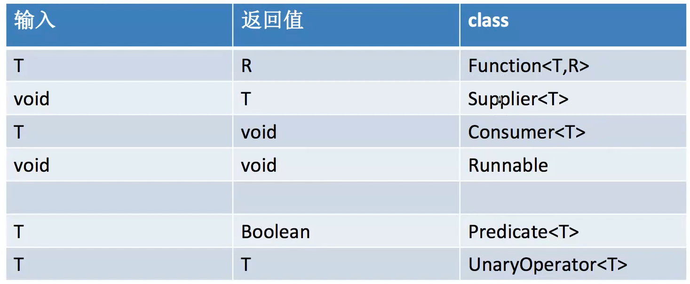

# 未来趋势：jdk8函数式编程（一）

​	往后两年的内卷趋势会从oop(面向对象)转向fp（函数式编程），所以标题挂上了未来趋势。这部分我会分为两个部分笔记进行叙述，以下是整体大纲。本章仅为入门，教你函数式编程的语法和使用。

### 大纲

**JAVA8 FP基础**

* FP特点
* Lambda表达式基本语法
* 函数式接口
* 方法引用

**JAVA8 FP进阶**

*  Stream基础API
* Filter/map/Reduce.
* Transducer


### 什么是函数式编程
*  一种编程范式
*  函数作为第一对象（1、函数可以作为一个变量。2、函数可以作为一个参数。3、返回值也可以是一个函数）
*  注重描述而非具体执行步骤（类似于写sql，把条件写好，然后去查询，而不是告诉数据库走哪个索引，怎么去查询）
  *  什么是“高级”和"低级"语言，相对于抽象的语言更为“高级“”，而具体到实现细节的语言较为“低级。（无意中伤

* 更关心代数结构之间的关系
* 不可变

  特别注意一点：FP和OOP并不是相互对立的，目前的语言趋势是趋近于混合的，所以不必刻意划清界限，OOP中可以有FP，FP下也能有OOP。代表语言：lisp(code as data)、js(前端经常用)、Scala。

  前端发展快，得益于js属于函数式语言，函数式语言让js这门语言进化的速度特别的快。

  特点2的三个体现，用js举例：fn是一个返回值，它是个函数。而a，b，c是传入的参数， 它们也可以是函数。

```java
	curry(fn)(a)(b)(c)
```

​	

### 函数式编程的编程特性

* 不可变（1、不用考虑并发问题。2、把对象状态变化完全拆解，减少了发生bug的可能性）
* 惰性求值（后面会讲，△留空标记△）
* 闭包（闭包能够将一个方法作为一个变量去存储，这个方法有能力去访问所在类的自由变量。）
* 高阶函数：callTwice就是一个高阶函数，可以在内部无限调用自己的内部函数，因为它的阶级比fn高。

```
 callTwice(fn){ return ()->{fn();fn();}}
```

* 柯里化（入门基础，后面会讲，目前jdk8用不了）
* 部分应用：可以不把参数写齐（目前jdk8用不了）

```java
 callTwice(a,b,c){}; fn2=callTwice(a,b); fn2(c);
```

* 结合率(一些组合)

目前java的jdk8只实现了部分FP功能，但后续更新的高阶版本已经逐步纳入了FP越来越多的功能，一定要学好这部分。


### JAVA8之前早已存在的适用函数式编程的场景(Lambda表达式解决的痛点)

* 创建线程 (匿名内部类，但匿名内部类会生成class文件，而lambda不会)
* 策略模式，如comparator
* UI编程
* 异步回调

### Lambda表达式

* 正常的方法：

```java
public static void fn（T param1,R param2...）{
    //......
	//......
}
```

* lambda表达式

```java
XXFunction fn=（T param1，R param2）->{
    //......
    //......
}
```

### Lambda表达式语法糖

​	原式:

```java
static Function<Integer,String> intString_1 =
            (Integer i)->{return String.valueOf(i);};
```

* 参数类型可推导

```java
static Function<Integer,String> intString_2 =
            (Integer i)-> String.valueOf(i);
```

* 单行可省略大括号

```java
    static Function<Integer,String> intString_3 =
            (i)-> String.valueOf(i);
```

* 单参数可省略小括号

```
    static Function<Integer,String> intString_4 =
            i-> String.valueOf(i);
```

### 函数式接口SAM(Single Abstract Method)

* 只有一个方法

```java
@FunctionInterface   //非必要，如果加上，编译器会进行校验   @FunctionInterface是为了告诉别人，他是函数式接口
public Interface Runnable{   //必须是interface
	public abstract void run(); //单个非默认/静态实现方法
}

相当于：Runnable r =() ->System.out.println("hello"); 
```

### 必须掌握的内置常用函数式接口



* Function<T,R>:传入的是T，传出的可以是R，说明传入和传出可以不同。
* Supplier <T>: 生产者，没有输入但是有产出。
* Consumer<T>:消费者，只有传入，没有传出。
* Runnable:无产出，也不消费。
* Predicate<T>：进行判断的方法，传入任意类型，产出布尔值。
* UnaryOperator<T,T>：传入和产出一样类型。

### 思考

```java
a->b->c->d代表什么？
```

```java
a->(b->c->d);  b->(c->d);c->d; 或 fn=a->b->c->d;相当于fn1=f(a);fn2=fn1(b);d=fn2(c);
特别注意：
    b->(c->d)是一个consumer，
    a->b->(c->d);是一个function，它的返回是b->(c->d)
	例：Function<T,Consumer> fn =a -> b->{}    
```

### 方法引用

* 静态方法→需要告之属于哪个类   									classX : :methodName
* 构造方法-→需要告之属于哪个类                                      classX :: new
* 指定实例方法→需要告之属于哪个实例                            instance :: methodName